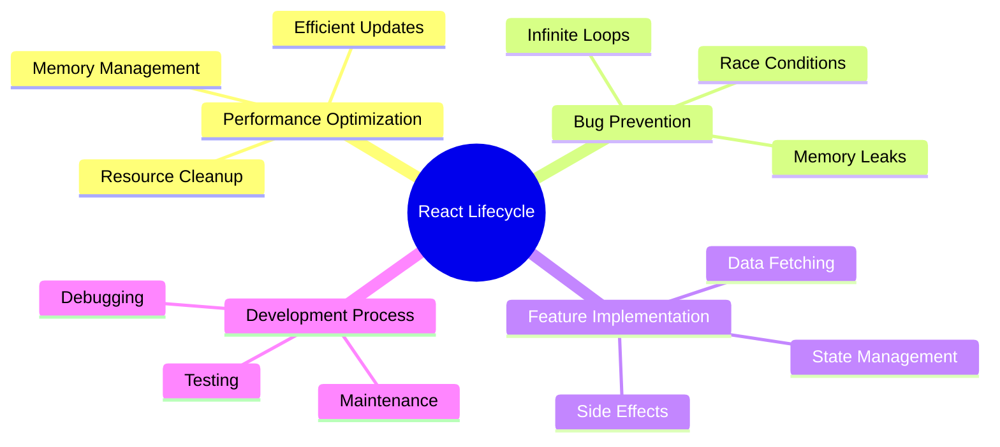
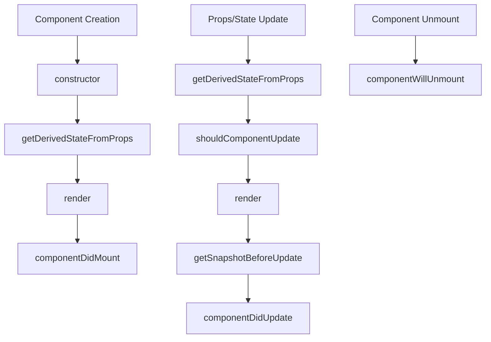
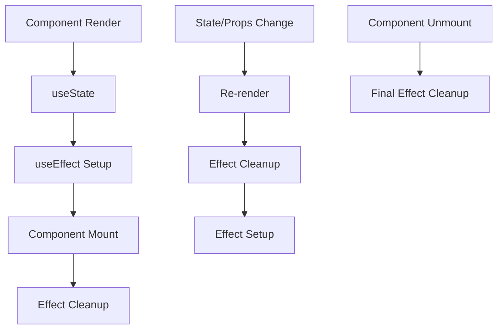
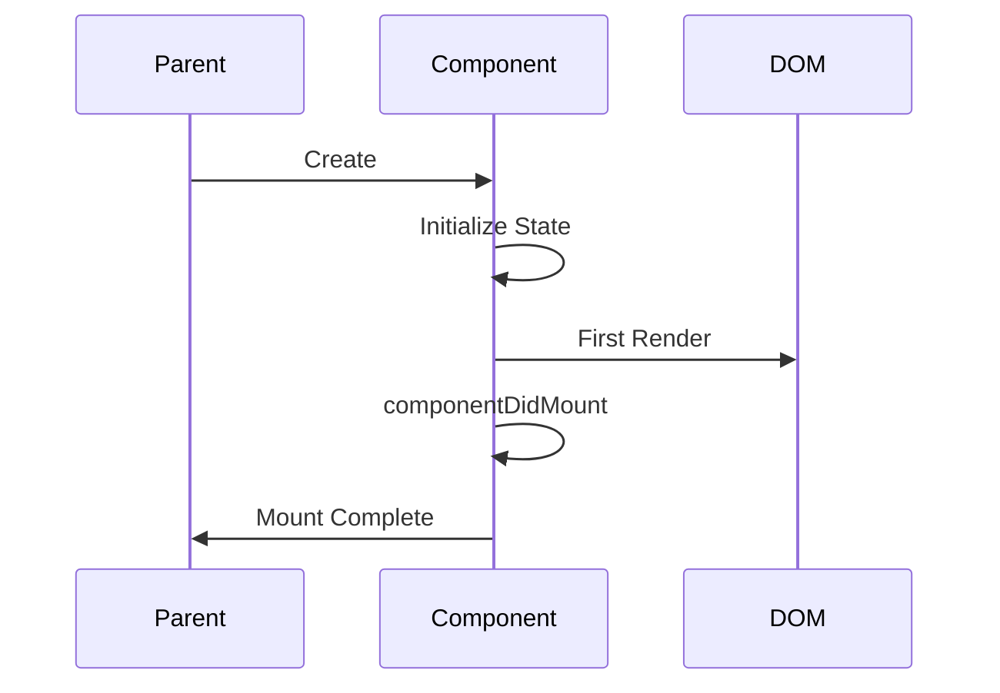
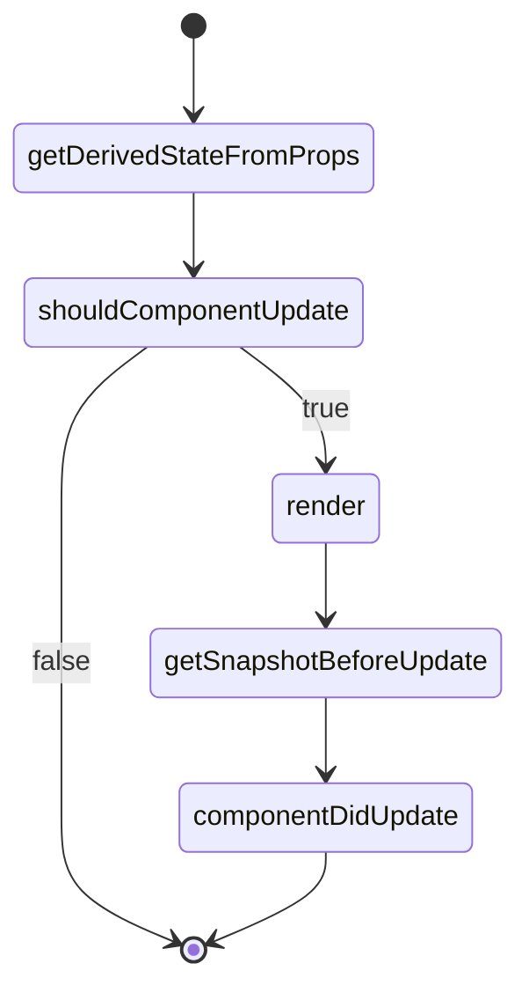
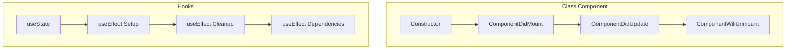
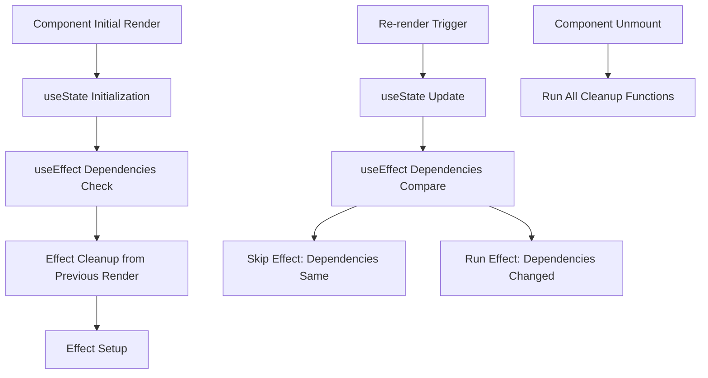
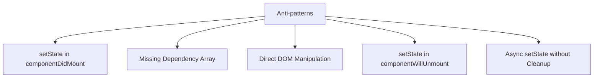
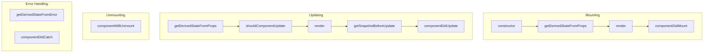

# React Component Lifecycle

## Table of Contents

- [Introduction](#introduction)
- [Lifecycle Overview](#lifecycle-overview)
- [Mounting Phase](#mounting-phase)
- [Updating Phase](#updating-phase)
- [Unmounting Phase](#unmounting-phase)
- [Error Handling](#error-handling)
- [Hooks vs Class Components](#hooks-vs-class-components)
- [Modern React with Hooks: A Deep Dive](#modern-react-with-hooks-a-deep-dive)
- [Best Practices](#best-practices)
- [Common Pitfalls](#common-pitfalls)
- [Real-World Examples](#real-world-examples)
- [Resources & Further Reading](#resources--further-reading)

## Introduction

React component lifecycle represents the series of events that happen from the time a component is created and mounted on the DOM to when it is unmounted and destroyed. Understanding these lifecycle phases is crucial for building efficient and bug-free React applications.

### Why Understanding Lifecycle is Important



## Lifecycle Overview

### Class Component Lifecycle



### Functional Component with Hooks



## Mounting Phase

### Constructor (Class Components)

```javascript
class MyComponent extends React.Component {
  constructor(props) {
    super(props);
    this.state = {
      data: null,
      loading: true,
    };
  }
}
```

### Initial Render



## Updating Phase

### Update Triggers

1. Props Change
2. State Update
3. Parent Re-render
4. Context Change

### Update Lifecycle Methods



## Unmounting Phase

### Cleanup Operations

```javascript
// Class Component
componentWillUnmount() {
  // Clean up subscriptions
  this.subscription.unsubscribe();
  // Clear intervals/timeouts
  clearInterval(this.intervalId);
  // Remove event listeners
  window.removeEventListener('resize', this.handleResize);
}

// Functional Component
useEffect(() => {
  const subscription = dataSource.subscribe();
  return () => {
    subscription.unsubscribe();
  };
}, []);
```

## Error Handling

### Error Boundaries

```javascript
class ErrorBoundary extends React.Component {
  constructor(props) {
    super(props);
    this.state = { hasError: false };
  }

  static getDerivedStateFromError(error) {
    return { hasError: true };
  }

  componentDidCatch(error, errorInfo) {
    logErrorToService(error, errorInfo);
  }

  render() {
    if (this.state.hasError) {
      return <h1>Something went wrong.</h1>;
    }
    return this.props.children;
  }
}
```

## Hooks vs Class Components

### Lifecycle Method Equivalents

| Class Component          | Hooks Equivalent                            |
| ------------------------ | ------------------------------------------- |
| constructor              | useState                                    |
| componentDidMount        | `useEffect(() => {}, [])`                   |
| componentDidUpdate       | `useEffect(() => {}, [deps])`               |
| componentWillUnmount     | `useEffect(() => { return () => {}; }, [])` |
| shouldComponentUpdate    | `React.memo`                                |
| getDerivedStateFromProps | `useState` + `useEffect`                    |

### Common Patterns



## Modern React with Hooks: A Deep Dive

### Understanding Hooks Lifecycle



### Key Hooks and Their Lifecycle Behaviors

#### 1. useState

```javascript
function Counter() {
  // Initialize state - runs only once
  const [count, setCount] = useState(0);

  // Batched updates
  const incrementTwice = () => {
    setCount((prev) => prev + 1); // Update function form
    setCount((prev) => prev + 1); // Guaranteed to use latest state
  };

  // State updates with object merging
  const [state, setState] = useState({ count: 0, name: "John" });
  const updatePartially = () => {
    setState((prev) => ({
      ...prev, // Preserve other fields
      count: prev.count + 1,
    }));
  };
}
```

#### 2. useEffect Variations

```javascript
function CompleteEffectGuide({ id }) {
  // 1. Run on every render
  useEffect(() => {
    console.log("I run on every render");
  });

  // 2. Run only once (component mount)
  useEffect(() => {
    console.log("I run only once on mount");

    // Cleanup on unmount
    return () => {
      console.log("I run only once on unmount");
    };
  }, []);

  // 3. Run on specific dependencies
  useEffect(() => {
    console.log("I run when id changes");

    // Cleanup before next effect run
    return () => {
      console.log("I clean up before next effect or unmount");
    };
  }, [id]);

  // 4. Multiple effects organization
  useEffect(() => {
    // Data fetching
  }, [id]);

  useEffect(() => {
    // Event listeners
  }, []);

  useEffect(() => {
    // WebSocket connection
  }, []);
}
```

#### 3. useLayoutEffect

```javascript
function LayoutEffectExample() {
  const [width, setWidth] = useState(0);

  // Runs synchronously after DOM mutations
  useLayoutEffect(() => {
    // DOM measurements
    const measuredWidth = divRef.current.getBoundingClientRect().width;
    setWidth(measuredWidth);
  }, []);

  return <div ref={divRef}>Measured Width: {width}</div>;
}
```

### Advanced Hooks Patterns

#### 1. Custom Hooks with Lifecycle Management

```javascript
function useDataFetching(url) {
  const [state, setState] = useState({
    data: null,
    loading: true,
    error: null,
  });

  useEffect(() => {
    let mounted = true;

    const fetchData = async () => {
      try {
        setState((prev) => ({ ...prev, loading: true }));
        const response = await fetch(url);
        const data = await response.json();

        if (mounted) {
          setState({
            data,
            loading: false,
            error: null,
          });
        }
      } catch (error) {
        if (mounted) {
          setState({
            data: null,
            loading: false,
            error: error.message,
          });
        }
      }
    };

    fetchData();

    return () => {
      mounted = false;
    };
  }, [url]);

  return state;
}
```

#### 2. Conditional Effects Pattern

```javascript
function ConditionalEffectExample({ isEnabled }) {
  useEffect(() => {
    if (!isEnabled) return;

    const subscription = subscribe();

    return () => {
      subscription.unsubscribe();
    };
  }, [isEnabled]);
}
```

#### 3. Dependencies Management

```javascript
function DependenciesExample({ onDataChange, data }) {
  // 1. Function dependencies
  useEffect(() => {
    onDataChange(data);
  }, [onDataChange, data]); // Include both function and data

  // 2. Stable references with useCallback
  const handleData = useCallback(() => {
    processData(data);
  }, [data]);

  // 3. Object dependencies with useMemo
  const config = useMemo(
    () => ({
      id: data.id,
      type: data.type,
    }),
    [data.id, data.type],
  );
}
```

### Common Hooks Scenarios

#### 1. Subscription Management

```javascript
function SubscriptionComponent() {
  useEffect(() => {
    const subscription = source.subscribe({
      next: (data) => console.log(data),
      error: (error) => console.error(error),
    });

    return () => {
      subscription.unsubscribe();
    };
  }, []);
}
```

#### 2. Event Listener Management

```javascript
function EventListenerExample() {
  useEffect(() => {
    const handleResize = debounce(() => {
      // Handle resize
    }, 250);

    window.addEventListener("resize", handleResize);

    return () => {
      window.removeEventListener("resize", handleResize);
      handleResize.cancel(); // Clean up debounce
    };
  }, []);
}
```

#### 3. Async Operations

```javascript
function AsyncOperationsExample({ id }) {
  const [data, setData] = useState(null);

  useEffect(() => {
    let isCancelled = false;

    async function loadData() {
      try {
        const response = await fetch(`/api/data/${id}`);
        const newData = await response.json();

        if (!isCancelled) {
          setData(newData);
        }
      } catch (error) {
        if (!isCancelled) {
          console.error("Failed to load data:", error);
        }
      }
    }

    loadData();

    return () => {
      isCancelled = true;
    };
  }, [id]);
}
```

### Performance Optimization with Hooks

#### 1. useMemo for Expensive Computations

```javascript
function ExpensiveComponent({ data }) {
  // Memoize expensive computation
  const processedData = useMemo(() => {
    return data.map((item) => expensiveOperation(item));
  }, [data]);
}
```

#### 2. useCallback for Stable References

```javascript
function CallbackExample({ onItemClick }) {
  const handleClick = useCallback(
    (item) => {
      onItemClick(item.id);
    },
    [onItemClick],
  );
}
```

#### 3. Custom Hook for Debouncing

```javascript
function useDebounce(value, delay) {
  const [debouncedValue, setDebouncedValue] = useState(value);

  useEffect(() => {
    const timer = setTimeout(() => {
      setDebouncedValue(value);
    }, delay);

    return () => {
      clearTimeout(timer);
    };
  }, [value, delay]);

  return debouncedValue;
}
```

### Testing Hooks Lifecycle

```javascript
// 1. Testing Hook Initialization
test("initializes with correct state", () => {
  const { result } = renderHook(() => useState(0));
  expect(result.current[0]).toBe(0);
});

// 2. Testing Effect Cleanup
test("cleans up effect", () => {
  const cleanup = jest.fn();
  const { unmount } = renderHook(() => {
    useEffect(() => cleanup, []);
  });

  unmount();
  expect(cleanup).toHaveBeenCalled();
});

// 3. Testing Custom Hooks
test("custom hook behavior", async () => {
  const { result, waitForNextUpdate } = renderHook(() =>
    useDataFetching("api/data"),
  );

  expect(result.current.loading).toBe(true);
  await waitForNextUpdate();
  expect(result.current.loading).toBe(false);
});
```

### Common Pitfalls and Solutions

#### 1. Infinite Loops

```javascript
// Bad
function InfiniteLoopComponent() {
  const [count, setCount] = useState(0);

  useEffect(() => {
    setCount(count + 1); // Will cause infinite loop
  });
}

// Good
function FixedComponent() {
  const [count, setCount] = useState(0);

  useEffect(() => {
    const timer = setInterval(() => {
      setCount((prev) => prev + 1); // Use functional update
    }, 1000);

    return () => clearInterval(timer);
  }, []); // Empty dependency array
}
```

#### 2. Stale Closures

```javascript
// Bad
function StaleClosureExample() {
  const [count, setCount] = useState(0);

  useEffect(() => {
    const timer = setInterval(() => {
      console.log(count); // Stale closure
    }, 1000);

    return () => clearInterval(timer);
  }, []); // Missing dependency

  // Good
  useEffect(() => {
    const timer = setInterval(() => {
      setCount((prev) => prev + 1); // Using functional update
    }, 1000);

    return () => clearInterval(timer);
  }, []); // No need for dependencies
}
```

#### 3. Race Conditions

```javascript
function RaceConditionExample({ id }) {
  const [data, setData] = useState(null);

  useEffect(() => {
    let isCurrent = true;

    async function fetchData() {
      const response = await fetch(`/api/data/${id}`);
      const newData = await response.json();

      if (isCurrent) {
        setData(newData); // Only update if still current
      }
    }

    fetchData();

    return () => {
      isCurrent = false; // Prevent updates if component unmounted
    };
  }, [id]);
}
```

## Best Practices

### Performance Optimization

1. **Proper Dependencies**

```javascript
// Good
useEffect(() => {
  fetchData(userId);
}, [userId]);

// Bad
useEffect(() => {
  fetchData(userId);
}, []); // Missing dependency
```

2. **Cleanup Operations**

```javascript
useEffect(() => {
  const subscription = subscribe();
  return () => {
    subscription.unsubscribe();
  };
}, []);
```

3. **Conditional Updates**

```javascript
shouldComponentUpdate(nextProps, nextState) {
  return this.props.value !== nextProps.value;
}
```

### Common Anti-patterns to Avoid



## Real-World Examples

### Data Fetching Component

```javascript
function DataFetchingComponent({ id }) {
  const [data, setData] = useState(null);
  const [loading, setLoading] = useState(true);
  const [error, setError] = useState(null);

  useEffect(() => {
    let isMounted = true;

    async function fetchData() {
      try {
        setLoading(true);
        const response = await api.getData(id);
        if (isMounted) {
          setData(response);
          setError(null);
        }
      } catch (err) {
        if (isMounted) {
          setError(err);
          setData(null);
        }
      } finally {
        if (isMounted) {
          setLoading(false);
        }
      }
    }

    fetchData();

    return () => {
      isMounted = false;
    };
  }, [id]);

  if (loading) return <Loading />;
  if (error) return <Error error={error} />;
  return <DataDisplay data={data} />;
}
```

## Resources & Further Reading

### Official Documentation

- [React Documentation](https://react.dev/reference/react/Component)
- [Hooks API Reference](https://react.dev/reference/react/hooks)

### Additional Resources

- React DevTools for debugging
- Performance profiling tools
- Testing lifecycle methods

### Common Issues & Solutions

| Issue              | Solution                                         |
| ------------------ | ------------------------------------------------ |
| Memory Leaks       | Proper cleanup in useEffect/componentWillUnmount |
| Infinite Loops     | Correct dependency arrays                        |
| Race Conditions    | Cancellation tokens or mounted flags             |
| Performance Issues | Proper memoization and lifecycle optimizations   |

### Appendix: Lifecycle Method Cheat Sheet


