# Mermaid Diagrams in Markdown

## Table of Contents

- [Introduction to Mermaid](#introduction-to-mermaid)
- [Getting Started](#getting-started)
- [Diagram Types](#diagram-types)
  - [Flowcharts](#flowcharts)
  - [Sequence Diagrams](#sequence-diagrams)
  - [Class Diagrams](#class-diagrams)
  - [State Diagrams](#state-diagrams)
  - [Entity Relationship Diagrams](#entity-relationship-diagrams)
  - [Gantt Charts](#gantt-charts)
  - [Pie Charts](#pie-charts)
  - [User Journey Diagrams](#user-journey-diagrams)
- [Advanced Topics](#advanced-topics)
- [Troubleshooting](#troubleshooting)
- [Real-world Examples](#real-world-examples)

## Introduction to Mermaid

Mermaid is a powerful diagramming and charting tool that lets you create diagrams using text and code. It's particularly useful in Markdown documents as it allows you to version-control your diagrams and maintain them alongside your documentation.

### Why Use Mermaid?

- Text-based diagram creation
- Version control friendly
- Wide range of diagram types
- Easy to learn and use
- Integrated with many popular platforms

### Extended Benefits of Using Mermaid

1. **Maintainability**

   - Text-based format makes changes trackable in version control
   - Easy to review and merge diagram changes
   - Reduces diagram maintenance overhead

2. **Integration Capabilities**

   - GitHub and GitLab native support
   - VS Code integration through extensions
   - Compatible with most modern Markdown editors
   - Can be embedded in documentation websites

3. **Collaboration Benefits**

   - Team members can contribute without specialized diagram tools
   - Consistent diagram styling across team
   - Easy to share and reuse diagram components

4. **Cost-Effective**
   - No need for paid diagramming tools
   - Reduced training costs
   - Open-source community support

## Getting Started

To use Mermaid in Markdown, you need to wrap your diagram code in a code block with the `mermaid` language specifier:

\```mermaid graph TD A[Start] --> B{Is it working?} B -->|Yes| C[Great!] B -->|No| D[Check the documentation] \```

This will render as:

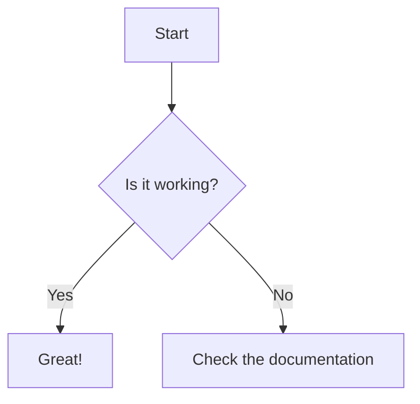

## Diagram Types

### Flowcharts

Flowcharts are one of the most commonly used diagram types. Here's a basic example:

\```mermaid graph LR A[Start] --> B(Process) B --> C{Decision} C -->|Yes| D[Result 1] C -->|No| E[Result 2] \```

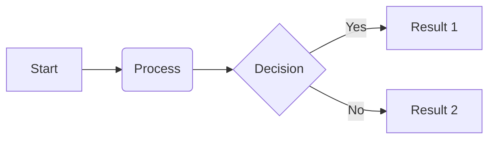

#### Flowchart Syntax

- Direction:

  - TB - top to bottom
  - BT - bottom to top
  - RL - right to left
  - LR - left to right

- Node Shapes:
  - `[]` - Rectangle
  - `()` - Round edges
  - `{}` - Diamond
  - `[[]]` - Subroutine
  - `[(database)]` - Database
  - `((circle))` - Circle

### Advanced Flowchart Techniques

#### Node Styles and Shapes

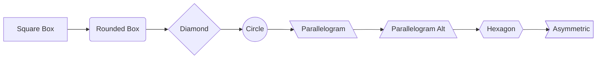

#### Detailed Node Configuration

1. **Basic Shapes**

   ```
   [Square Box]     - For processes
   (Rounded Box)    - For operations
   {Diamond}        - For decisions
   ((Circle))       - For connection points
   ```

2. **Database Shapes**

   ```
   [(Database)]     - For database elements
   [(...)] or [())] - For cylindrical shapes
   ```

3. **Special Shapes**
   ```
   [\Parallelogram\] - For input/output
   {{Hexagon}}      - For preparation steps
   [/Trapezoid\]    - For manual operations
   ```

#### Line Styles and Connections

```mermaid
graph LR
    A-->B           %% Solid line
    B-.->C          %% Dotted line
    C==>D           %% Thick line
    D-- text -->E   %% With text
    E-->|text|F     %% Alternate text syntax
    F-. text .->G   %% Dotted with text
    G== text ==>H   %% Thick with text
```

### Sequence Diagrams

Sequence diagrams show how processes operate with one another and in what order.

\```mermaid sequenceDiagram participant Client participant Server participant Database

    Client->>Server: Request Data
    Server->>Database: Query
    Database-->>Server: Return Results
    Server-->>Client: Send Response

\```

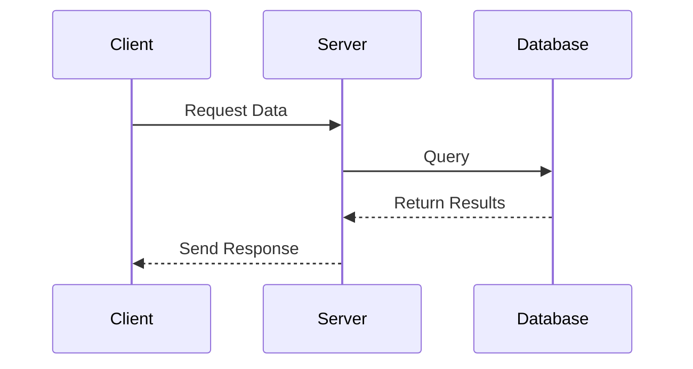

### Sequence Diagram Advanced Features

#### Detailed Participant Types

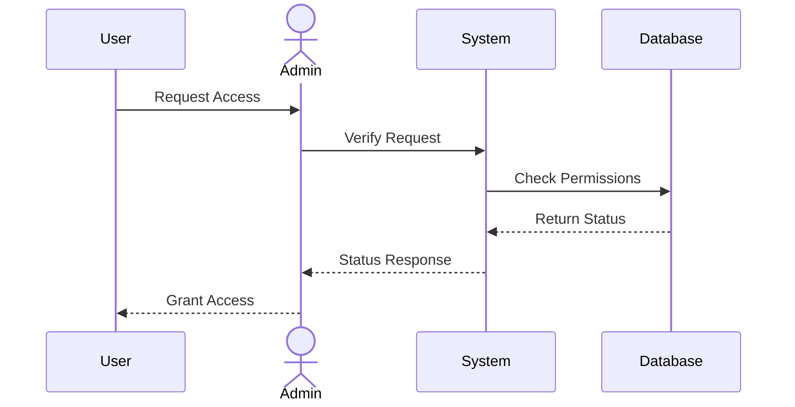

#### Alternative Paths and Loops

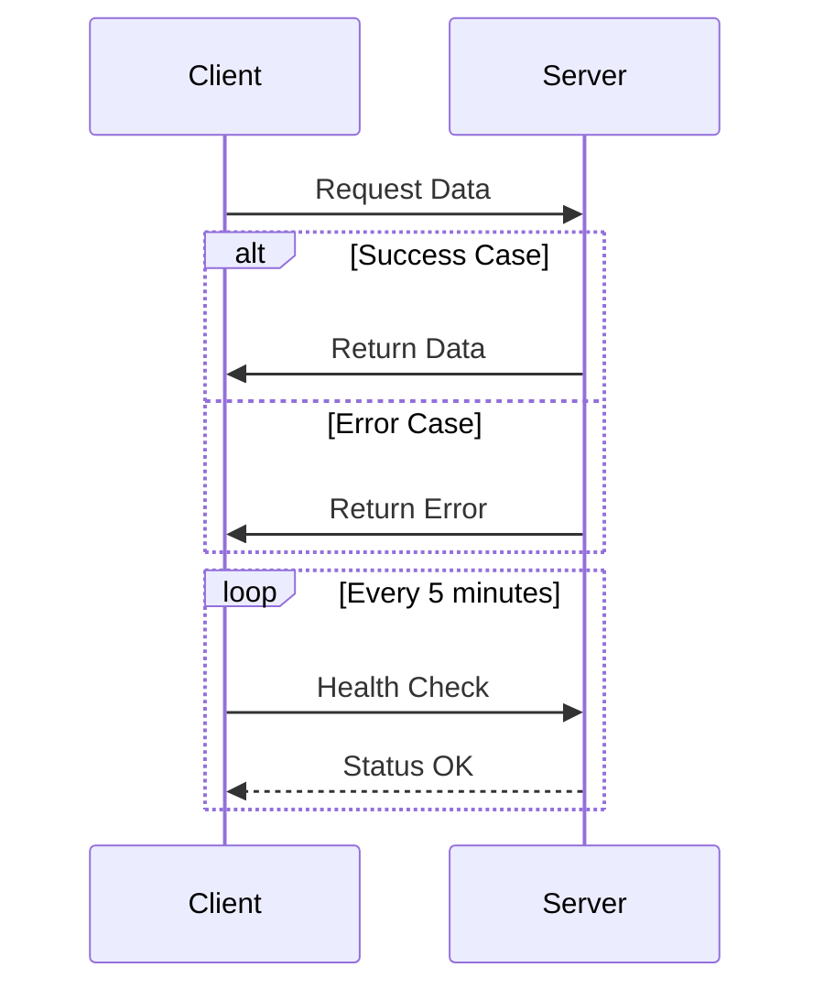

### Class Diagrams

Class diagrams are essential for object-oriented programming:

\```mermaid classDiagram class Animal { +String name +int age +makeSound() } class Dog { +bark() } class Cat { +meow() } Animal <|-- Dog Animal <|-- Cat \```

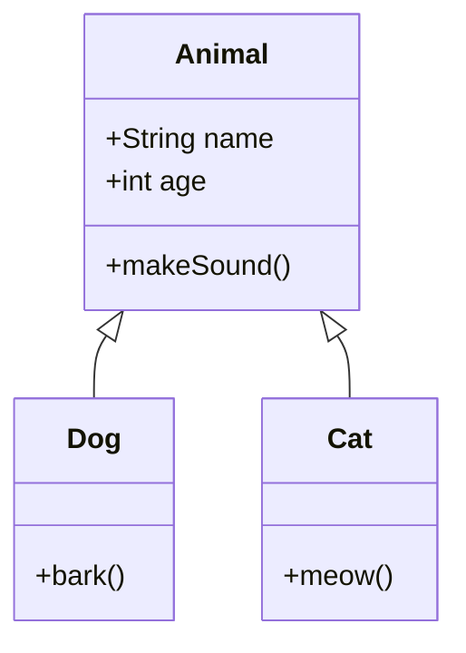

### Class Diagram Best Practices

#### Relationship Types

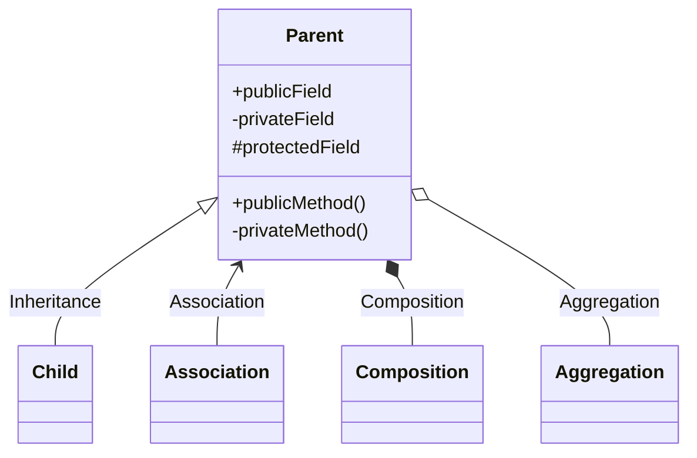

#### Visibility and Methods

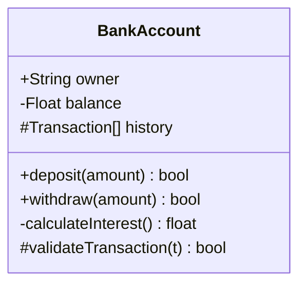

### State Diagrams

State diagrams show different states of a system:

\```mermaid stateDiagram-v2 [*] --> Still Still --> [*] Still --> Moving Moving --> Still Moving --> Crash Crash --> [*] \```

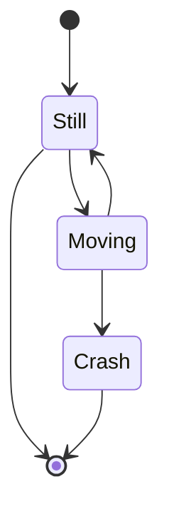

### State Diagram Complex Patterns

#### Composite States

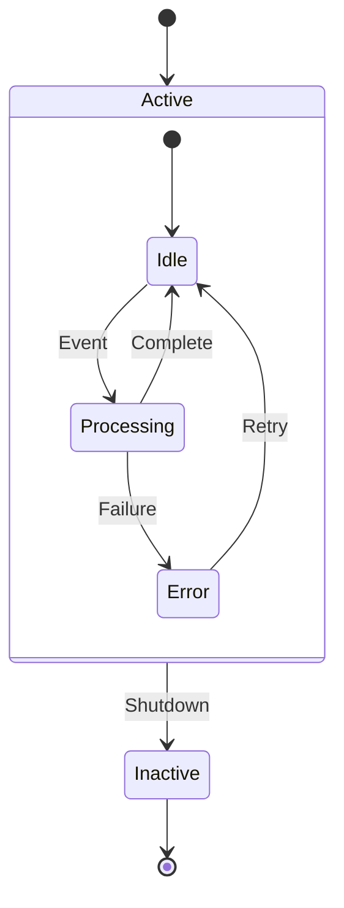

### Entity Relationship Diagrams

ERDs are useful for database design:

\```mermaid erDiagram CUSTOMER ||--o{ ORDER : places ORDER ||--|{ LINE-ITEM : contains CUSTOMER }|..|{ DELIVERY-ADDRESS : uses \```

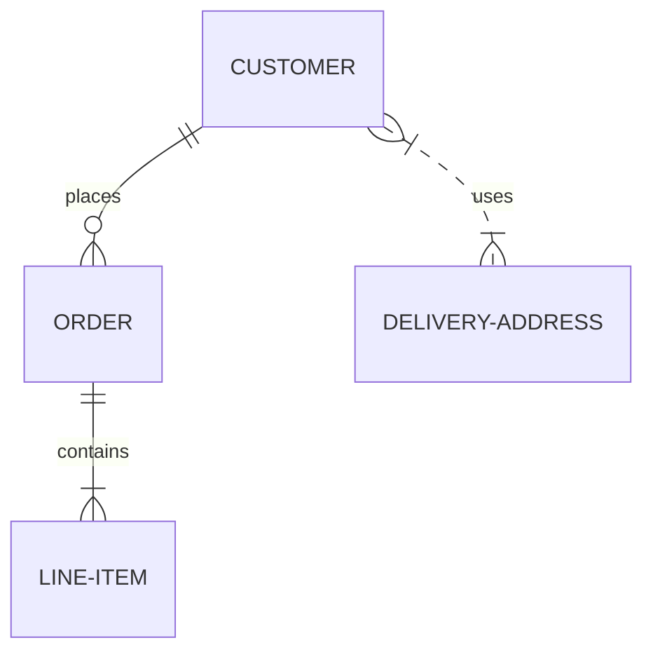

### Advanced ERD Relationships

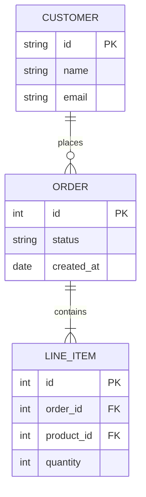

### Gantt Charts

Gantt charts are perfect for project planning:

\```mermaid gantt title Project Timeline dateFormat YYYY-MM-DD section Planning Requirements gathering :a1, 2024-01-01, 7d Design phase :a2, after a1, 10d section Development Implementation :a3, after a2, 15d Testing :a4, after a3, 5d \```

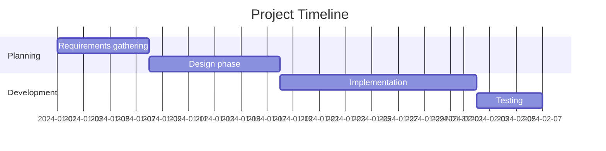

## Advanced Topics

### Styling and Themes

You can customize the appearance of your diagrams using themes and inline styles:

\```mermaid %%{init: {'theme': 'forest'}}%%

graph TD A[Christmas] -->|Get money| B(Go shopping) B --> C{Let me think} C -->|One| D[Laptop] C -->|Two| E[iPhone] C -->|Three| F[Car] \```

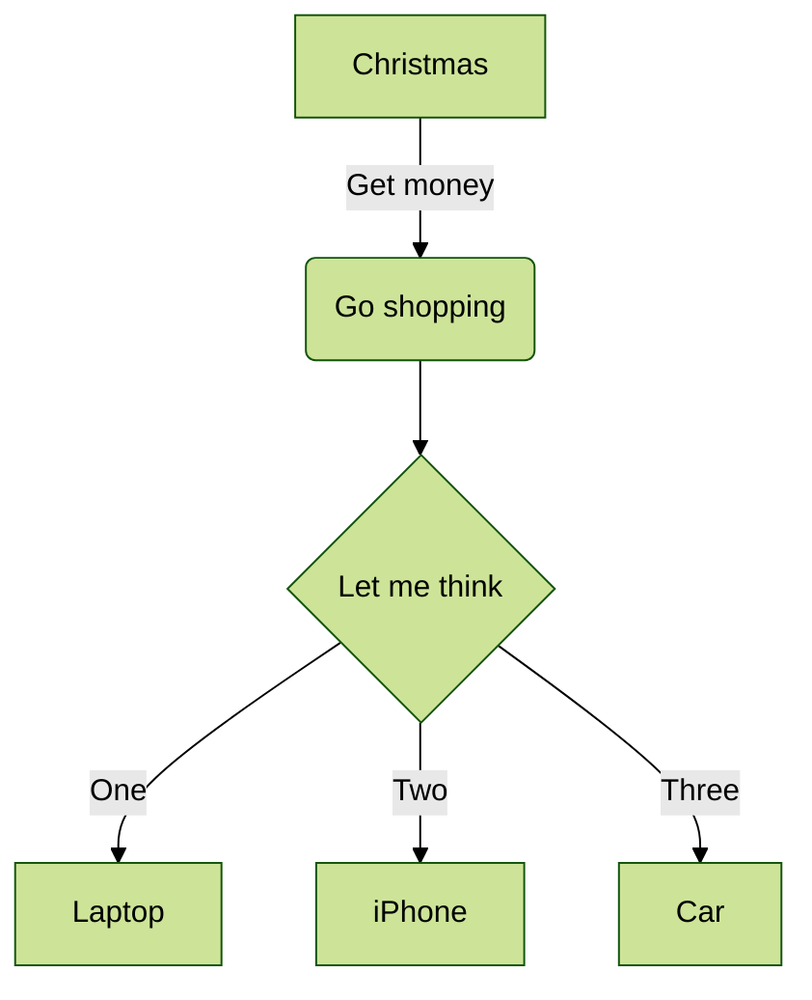

### Advanced Styling Techniques

#### Theme Customization

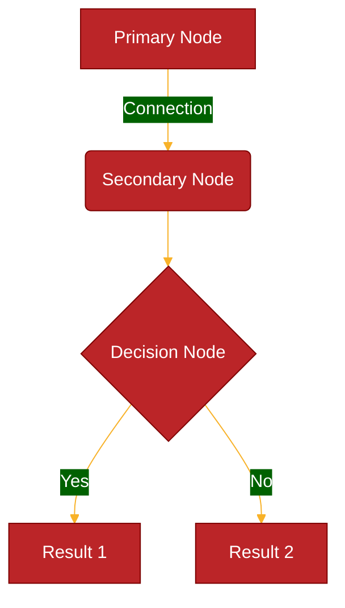

#### Font and Text Styling

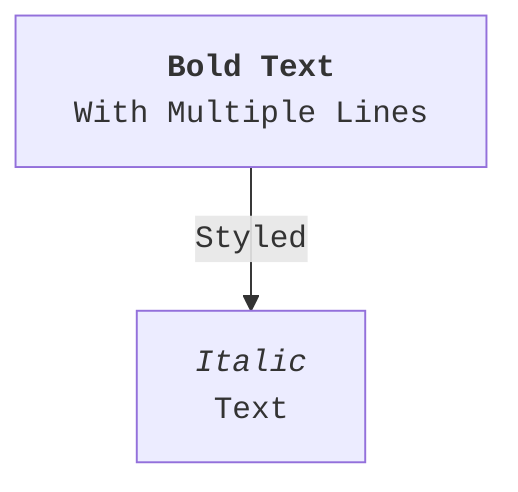

### Common Issues and Solutions

1. **Diagram Not Rendering**

   - Check if Mermaid is supported in your Markdown viewer
   - Verify syntax for the specific diagram type
   - Ensure proper indentation

2. **Complex Diagrams**
   - Break down into smaller sub-diagrams
   - Use clear naming conventions
   - Comment your diagram code

## Real-world Examples

### Software Architecture

\```mermaid graph TD subgraph Frontend A[Web App] --> B[API Gateway] end subgraph Backend B --> C[Load Balancer] C --> D[Service 1] C --> E[Service 2] D --> F[(Database)] E --> F end \```

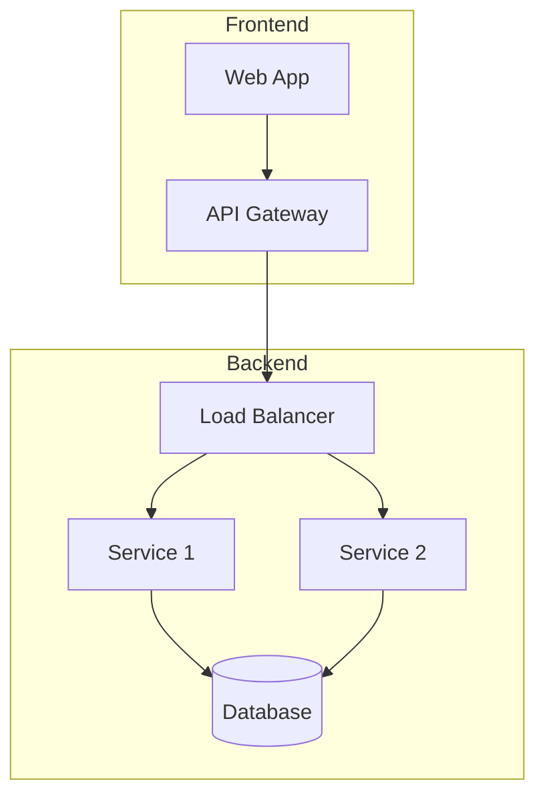

### Business Process

\```mermaid graph LR A[Customer Order] --> B{Stock Available?} B -->|Yes| C[Process Payment] B -->|No| D[Back Order] C --> E[Ship Order] D --> F[Notify Customer] F --> G[Wait for Stock] G --> C \```

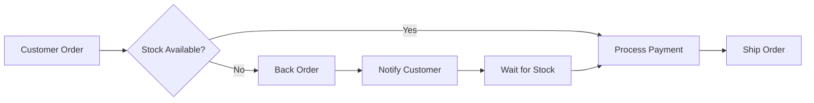

## Best Practices

1. **Keep It Simple**

   - Break complex diagrams into smaller ones
   - Use clear and consistent naming
   - Add comments for clarity

2. **Version Control**

   - Store diagrams with related documentation
   - Use meaningful commit messages
   - Review diagram changes during code review

3. **Documentation**
   - Include diagram descriptions
   - Explain non-obvious relationships
   - Keep diagrams up-to-date

## Extended Best Practices

### 1. Diagram Organization

#### Document Structure

- Start with a clear title and description
- Group related elements together
- Use consistent naming conventions
- Include legend or notes for complex diagrams

#### Modular Design

```mermaid
graph TD
    subgraph Frontend
        A[UI] --> B[State Management]
        B --> C[API Client]
    end
    subgraph Backend
        D[API Gateway] --> E[Services]
        E --> F[Database]
    end
    C --> D
```

### 2. Visual Clarity

#### Layout Guidelines

- Maintain consistent flow direction
- Limit nodes per diagram (15-20 maximum)
- Use meaningful spacing
- Align related elements

#### Color Usage

- Use colors sparingly and meaningfully
- Ensure sufficient contrast
- Consider colorblind-friendly palettes
- Maintain consistency across diagrams

### 3. Performance Optimization

#### Large Diagram Handling

- Break into smaller, linked diagrams
- Use subgraphs for grouping
- Consider lazy loading for web integration
- Optimize node placement for readability

#### Code Organization

- Use meaningful comments
- Separate style definitions
- Maintain consistent indentation
- Document complex relationships

## Troubleshooting Guide

### Common Issues and Solutions

1. **Rendering Problems**

   - Verify syntax is correct
   - Check for missing closing brackets
   - Ensure proper line breaks
   - Validate direction specifiers

2. **Style Issues**

   - Check theme compatibility
   - Verify CSS overrides
   - Validate color codes
   - Check font availability

3. **Performance Issues**
   - Reduce diagram complexity
   - Optimize node placement
   - Use appropriate direction
   - Consider breaking into sub-diagrams

## Integration Examples

### VS Code Integration

1. **Extension Setup**

   - Install Markdown Preview Mermaid Support
   - Configure auto-preview
   - Set up custom themes
   - Enable syntax highlighting

2. **Workspace Settings**

```json
{
	"markdown.mermaid.enabled": true,
	"markdown.mermaid.theme": "default",
	"markdown.preview.breaks": true
}
```

### Documentation Site Integration

1. **MkDocs Integration**

```yaml
markdown_extensions:
  - pymdownx.superfences:
      custom_fences:
        - name: mermaid
          class: mermaid
          format: !!python/name:pymdownx.superfences.fence_code_format
```

2. **VuePress Integration**

```js
module.exports = {
	markdown: {
		extendMarkdown: (md) => {
			md.set({ breaks: true })
			md.use(require('markdown-it-mermaid').default)
		},
	},
}
```

## Real-World Application Examples

### Software Architecture Documentation

```mermaid
graph TD
    subgraph Client
        A[Web App] --> B[Redux Store]
        B --> C[API Client]
    end
    subgraph Cloud
        D[Load Balancer] --> E[API Gateway]
        E --> F[Service Mesh]
        F --> G[(Primary DB)]
        F --> H[(Cache)]
        F --> I[Message Queue]
    end
    C --> D
```

### Business Process Modeling

```mermaid
graph TD
    A[Order Received] --> B{Inventory Check}
    B -->|Available| C[Process Payment]
    B -->|Out of Stock| D[Back Order]
    C --> E{Payment Status}
    E -->|Success| F[Prepare Shipment]
    E -->|Failure| G[Notify Customer]
    F --> H[Ship Order]
    H --> I[Update Inventory]
    I --> J[Close Order]
    D --> K[Order from Supplier]
    K --> L[Wait for Restock]
    L --> C
```

## Additional Resources and Tools

### Development Tools

1. **Online Editors**

   - [Mermaid Live Editor](https://mermaid.live/)
   - [Mermaid.js Online Editor](https://mermaid-js.github.io/mermaid-live-editor/)

2. **Integration Tools**
   - VS Code Extensions
   - Browser Extensions
   - CI/CD Pipeline Tools

### Learning Resources

1. **Documentation**

   - [Official Mermaid.js Docs](https://mermaid.js.org/)
   - [GitHub Wiki](https://github.com/mermaid-js/mermaid/wiki)
   - [Community Examples](https://mermaid-js.github.io/mermaid/#/examples)

2. **Community Resources**
   - Stack Overflow Tags
   - GitHub Discussions
   - Medium Articles
   - YouTube Tutorials
