# Product Requirements Document (PRD): A Comprehensive Guide

## Table of Contents

1. [Introduction to PRD in Software Development](#introduction-to-prd-in-software-development)
2. [Key Components of a PRD](#key-components-of-a-prd)
3. [Best Practices for Writing an Effective PRD](#best-practices-for-writing-an-effective-prd)
4. [PRD vs. Other Documentation Types](#prd-vs-other-documentation-types)
5. [Common PRD Mistakes & How to Avoid Them](#common-prd-mistakes--how-to-avoid-them)
6. [PRD Templates & Real-World Examples](#prd-templates--real-world-examples)
7. [Advanced PRD Techniques](#advanced-prd-techniques)
8. [Resources & Further Reading](#resources--further-reading)

## Introduction to PRD in Software Development

### What is a Product Requirements Document (PRD)?

A Product Requirements Document (PRD) is a comprehensive document that outlines the requirements, specifications, features, and objectives of a software product. It serves as a central reference point for all stakeholders involved in the product development lifecycle.

### Evolution of PRDs

```mermaid
timeline
    title Evolution of Product Requirements Documentation
    1960s : Initial Documentation
            Basic specifications
            Hardware-focused
    1970s : Traditional Waterfall PRDs
            Lengthy documents
            Sequential development
            Formal sign-offs
    1980s : Structured Analysis
            Data flow diagrams
            Entity-relationship models
            Formal methodologies
    1990s : Structured PRDs
            Use case driven
            UML integration
            Object-oriented approach
    2000s : Agile Adaptation
            User stories
            Iterative approach
            Lightweight docs
    2010s : Modern PRD
            Living documents
            Integration with tools
            Cloud collaboration
    2020s : AI-Enhanced PRDs
            Automated generation
            Real-time collaboration
            Smart analytics
            Dynamic updates
```

### Why PRDs Are Essential

PRDs play a crucial role in software development by:

1. **Alignment**

   - Ensuring all stakeholders share the same vision
   - Establishing clear goals and objectives
   - Defining success criteria

2. **Communication**

   - Facilitating cross-team collaboration
   - Reducing misunderstandings
   - Providing a single source of truth

3. **Decision Making**
   - Guiding prioritization
   - Supporting resource allocation
   - Enabling informed trade-offs

### PRDs in the Software Development Lifecycle

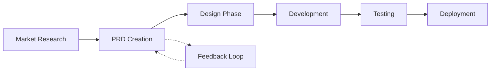

### PRD Stakeholders

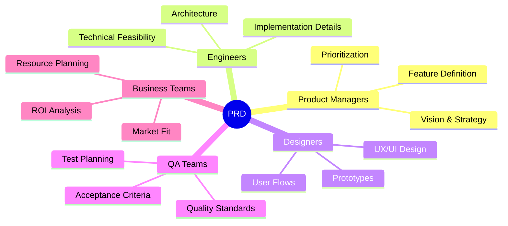

## Key Components of a PRD

### 1. Product Overview

#### Vision Statement

A clear, concise statement that defines:

- The product's purpose
- Target market
- Key differentiators
- Long-term goals

Example:

> "To create a collaborative project management platform that empowers remote teams to work efficiently by combining real-time communication, task management, and document collaboration in a single, intuitive interface."

#### Market Opportunity

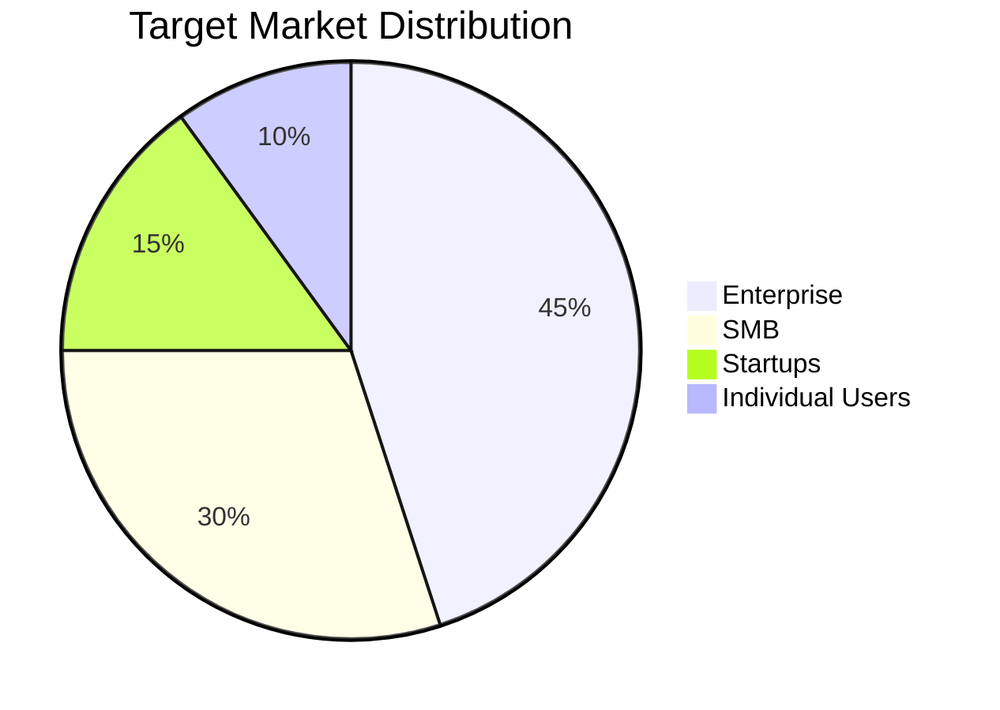

### 2. Business Case & Justification

#### Competitive Analysis Matrix

| Feature                 | Our Product | Competitor A | Competitor B | Competitor C | Competitor D |
| ----------------------- | ----------- | ------------ | ------------ | ------------ | ------------ |
| Real-time Collaboration | ✅          | ✅           | ❌           | ✅           | ⚠️           |
| Custom Workflows        | ✅          | ❌           | ✅           | ❌           | ✅           |
| API Integration         | ✅          | ✅           | ✅           | ❌           | ✅           |
| Mobile Support          | ✅          | ✅           | ❌           | ✅           | ✅           |
| Enterprise SSO          | ✅          | ✅           | ❌           | ❌           | ✅           |
| Offline Mode            | ✅          | ❌           | ❌           | ✅           | ❌           |
| Custom Reports          | ✅          | ⚠️           | ✅           | ❌           | ✅           |
| AI-Powered Features     | ✅          | ❌           | ⚠️           | ❌           | ✅           |
| White-labeling          | ✅          | ✅           | ❌           | ❌           | ⚠️           |
| Data Export Options     | ✅          | ✅           | ✅           | ⚠️           | ✅           |

Legend:

- ✅ Full Support
- ⚠️ Partial Support
- ❌ No Support

#### Detailed Feature Comparison

##### Real-time Collaboration

- Our Product: Full concurrent editing, presence awareness, commenting
- Competitor A: Basic real-time viewing, no concurrent editing
- Competitor B: No real-time features
- Competitor C: Limited to chat and comments
- Competitor D: Basic collaborative features

##### Custom Workflows

- Our Product:
  - Visual workflow builder
  - Conditional logic
  - Automation rules
  - Custom triggers
  - API webhooks
- Competitor A: No workflow customization
- Competitor B: Basic workflow templates
- Competitor C: Fixed workflows only
- Competitor D: Limited workflow customization

#### ROI Projections

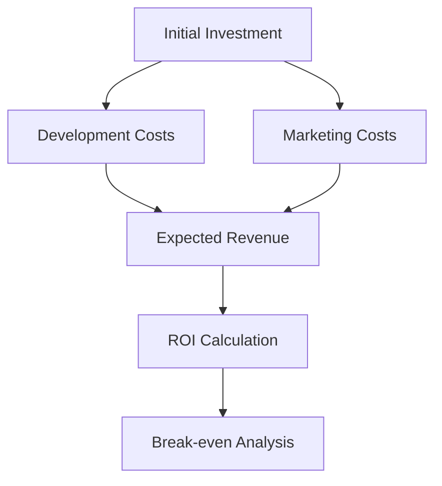

### 3. User Personas & Use Cases

#### Primary Persona Example

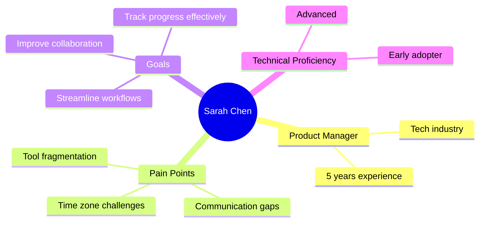

#### Extended Persona Examples

##### Technical Lead Persona

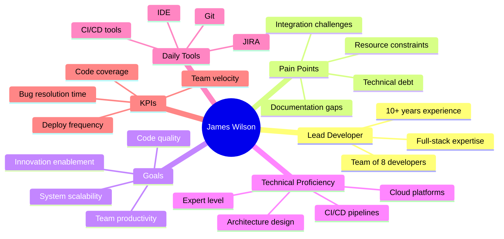

##### Product Owner Persona

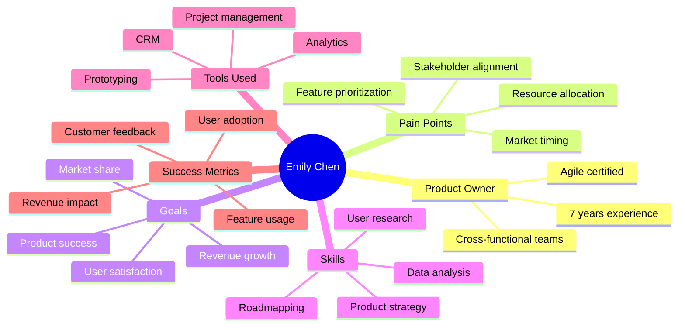

#### User Journey Map

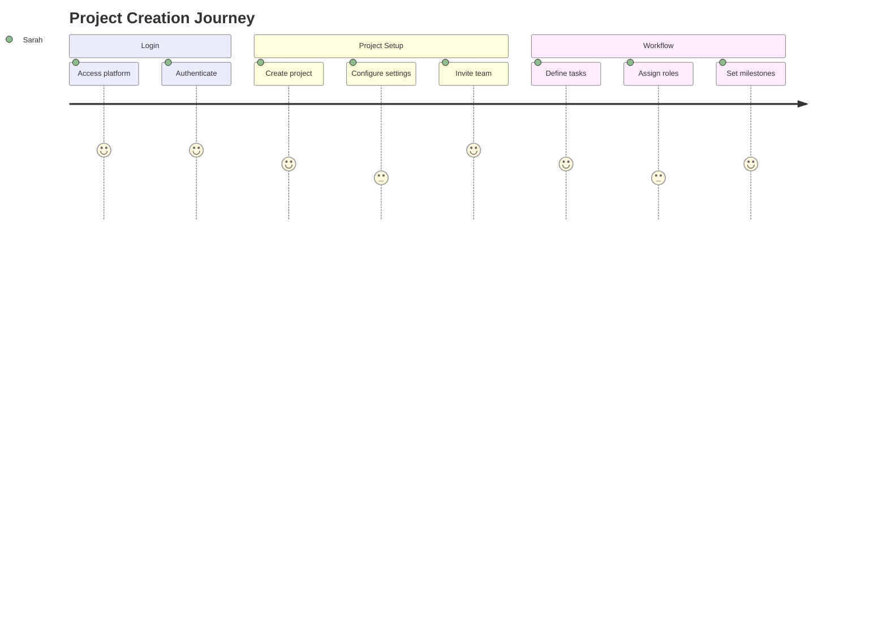

### 4. Product Features & Functional Requirements

#### Feature Hierarchy (MoSCoW Method)

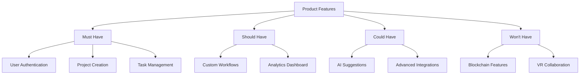

#### User Story Template

```markdown
As a [type of user] I want to [perform an action] So that [achieve a goal/benefit]

Acceptance Criteria:

1. Given [precondition] When [action] Then [expected result]

2. Given [another precondition] When [action] Then [expected result]
```

#### User Stories with Acceptance Criteria

Example 1: User Authentication

```markdown
As a new user I want to create an account So that I can access the platform's features

Acceptance Criteria:

1. Given I am on the registration page When I enter valid email and password Then my account should be created And I should receive a confirmation email

2. Given I enter an existing email When I try to register Then I should see an error message And the form should not be submitted

3. Given I enter an invalid password When I try to register Then I should see password requirements And the form should show validation errors

Technical Requirements:

- Password must be at least 8 characters
- Password must contain upper, lower, number, special char
- Email verification must expire in 24 hours
- Maximum 3 failed login attempts before temporary lockout

Non-functional Requirements:

- Registration process should complete in < 3 seconds
- Support for 100,000 concurrent registrations
- 99.99% uptime for auth services
```

Example 2: Project Creation

```markdown
As a project manager I want to create a new project workspace So that I can organize team activities and track progress

Acceptance Criteria:

1. Given I am logged in When I click "New Project" Then I should see the project creation form And be able to set project details

2. Given I am creating a project When I submit without required fields Then I should see validation errors And the form should not be submitted

3. Given I create a project When it is successfully created Then team members should receive invitations And default project structure should be set up

Technical Requirements:

- Project IDs must be unique
- Support for nested project hierarchies
- Real-time project status updates
- Automated role-based access control

Non-functional Requirements:

- Project creation should take < 2 seconds
- Support for 10,000 projects per workspace
- Project data must be backed up every 6 hours
```

### 5. UX/UI and Design Considerations

#### Wireframe Example

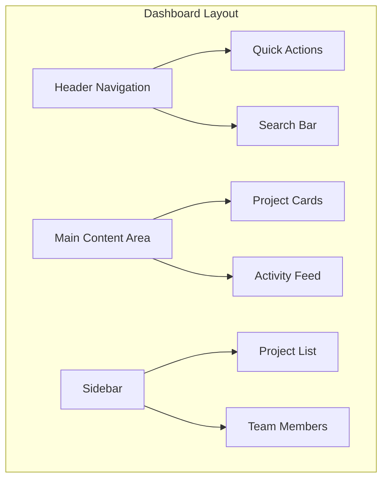

#### Comprehensive Wireframe Examples

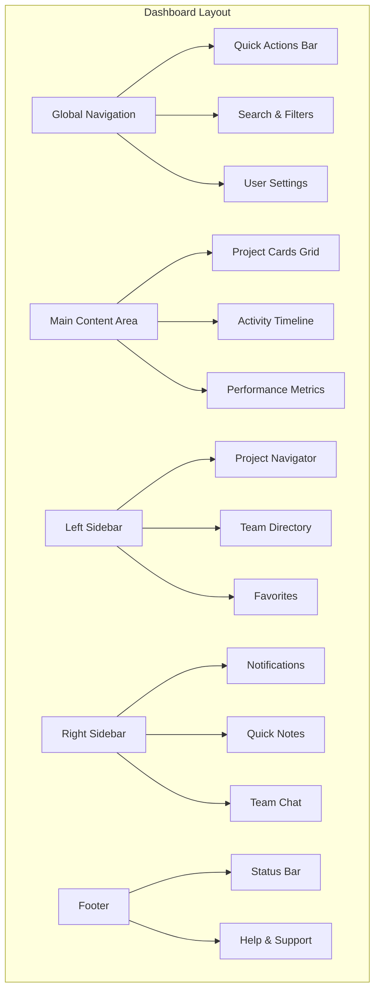

#### Accessibility Guidelines

- WCAG 2.1 Compliance
- Keyboard Navigation
- Screen Reader Support
- Color Contrast Requirements

#### Design System Components

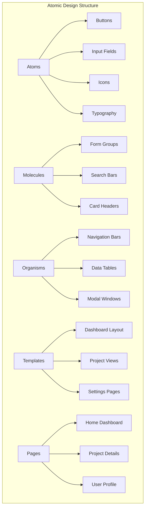

### 6. Technical Requirements & Constraints

#### Architecture Overview

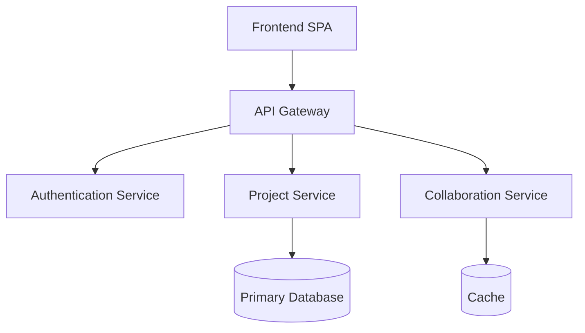

### Technical Architecture Deep Dive

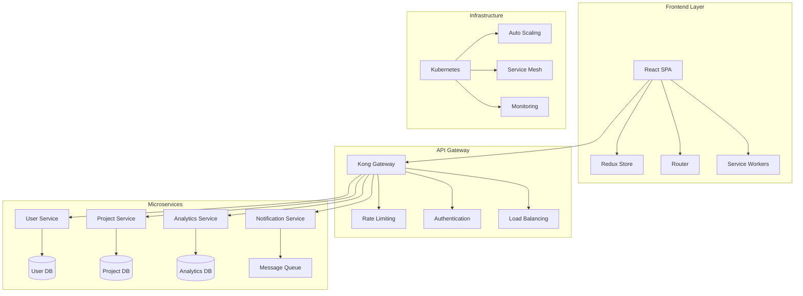

#### API Dependencies

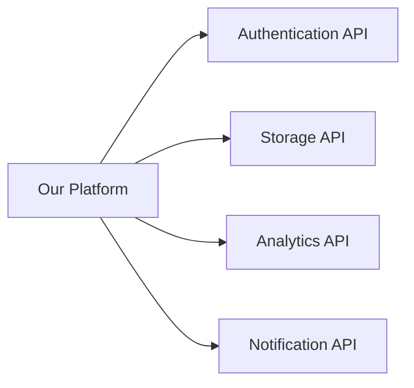

### 7. Assumptions & Dependencies

#### Risk Assessment Matrix

| Risk                    | Probability | Impact | Mitigation Strategy                         |
| ----------------------- | ----------- | ------ | ------------------------------------------- |
| API Service Downtime    | Medium      | High   | Implement retry logic & fallback mechanisms |
| Data Migration Issues   | Low         | High   | Thorough testing & rollback plan            |
| User Adoption           | Medium      | High   | Beta testing & user feedback loops          |
| Performance Scalability | Low         | Medium | Load testing & optimization                 |

### 8. Success Metrics & KPIs

#### Key Performance Indicators

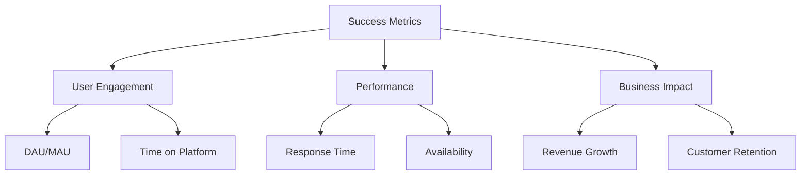

### 9. Roadmap & Development Timeline

#### Development Phases

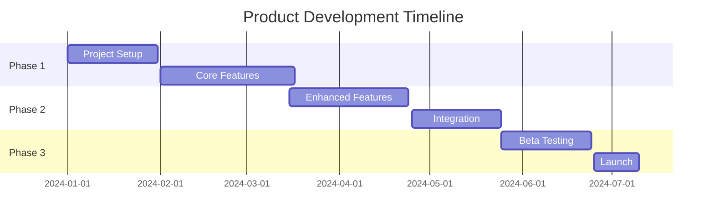

### Security Requirements & Compliance

#### Authentication & Authorization Matrix

| Role            | View Projects | Create Projects | Manage Users | Access Analytics | Configure System |
| --------------- | ------------- | --------------- | ------------ | ---------------- | ---------------- |
| System Admin    | ✅            | ✅              | ✅           | ✅               | ✅               |
| Project Manager | ✅            | ✅              | ⚠️           | ✅               | ❌               |
| Team Lead       | ✅            | ✅              | ❌           | ⚠️               | ❌               |
| Developer       | ✅            | ❌              | ❌           | ❌               | ❌               |
| Viewer          | ⚠️            | ❌              | ❌           | ❌               | ❌               |

Legend:

- ✅ Full Access
- ⚠️ Limited Access
- ❌ No Access

#### Security Requirements Checklist

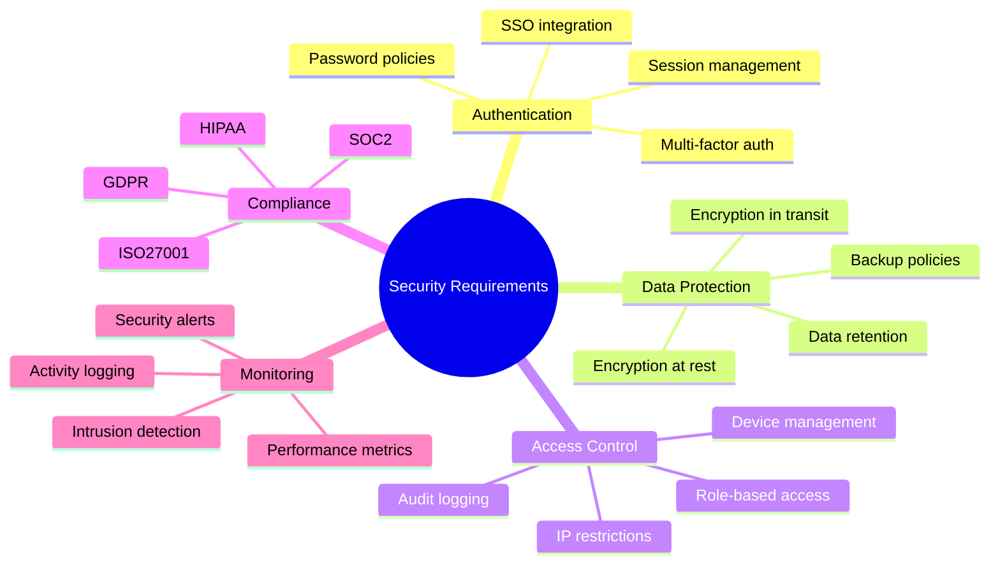

### Performance Requirements

#### System Performance Metrics

| Metric              | Target Value | Acceptable Range | Critical Threshold |
| ------------------- | ------------ | ---------------- | ------------------ |
| Page Load Time      | < 2s         | 2-3s             | > 3s               |
| API Response Time   | < 200ms      | 200-500ms        | > 500ms            |
| Database Query Time | < 100ms      | 100-300ms        | > 300ms            |
| Concurrent Users    | 10,000       | 5,000-10,000     | < 5,000            |
| System Uptime       | 99.99%       | 99.9-99.99%      | < 99.9%            |
| Error Rate          | < 0.1%       | 0.1-0.5%         | > 0.5%             |

#### Load Testing Scenarios

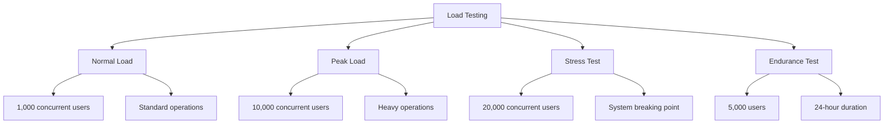

### Integration Requirements

#### API Integration Specifications

```mermaid
sequenceDiagram
    participant Client
    participant API Gateway
    participant Auth Service
    participant Business Logic
    participant Database

    Client->>API Gateway: Request with JWT
    API Gateway->>Auth Service: Validate Token
    Auth Service-->>API Gateway: Token Valid
    API Gateway->>Business Logic: Process Request
    Business Logic->>Database: Query Data
    Database-->>Business Logic: Return Results
    Business Logic-->>API Gateway: Processed Response
    API Gateway-->>Client: Final Response
```

#### Third-party Integration Matrix

| Integration Type | Provider Options                                  | Implementation Complexity | Timeline | Dependencies      |
| ---------------- | ------------------------------------------------- | ------------------------- | -------- | ----------------- |
| Authentication   | - OAuth2<br/>- SAML<br/>- OpenID                  | Medium                    | 2 weeks  | Identity Provider |
| Payment          | - Stripe<br/>- PayPal<br/>- Square                | High                      | 3 weeks  | Payment Gateway   |
| Storage          | - AWS S3<br/>- Google Cloud<br/>- Azure           | Low                       | 1 week   | Cloud Provider    |
| Analytics        | - Google Analytics<br/>- Mixpanel<br/>- Amplitude | Medium                    | 2 weeks  | Tracking Setup    |

### Quality Assurance Requirements

#### Test Coverage Matrix

```mermaid
pie title Test Coverage Distribution
    "Unit Tests" : 40
    "Integration Tests" : 30
    "E2E Tests" : 20
    "Performance Tests" : 10
```

#### Testing Scenarios Template

```markdown
Test Case ID: TC-001 Category: Authentication Priority: High

Scenario: User Login with Valid Credentials

Preconditions:

- User account exists
- User is not logged in
- System is accessible

Test Steps:

1. Navigate to login page
2. Enter valid username
3. Enter valid password
4. Click login button

Expected Results:

- User successfully logs in
- Redirected to dashboard
- Session is created
- Activity is logged

Actual Results: [To be filled during testing]

Pass/Fail Criteria:

- All expected results must be met
- Response time < 2 seconds
- No security warnings
```

### Deployment & DevOps Requirements

#### Infrastructure Architecture

```mermaid
graph TD
    subgraph Production Environment
        A[Load Balancer] --> B1[Web Server 1]
        A --> B2[Web Server 2]
        B1 --> C[Application Server Cluster]
        B2 --> C
        C --> D1[(Primary DB)]
        C --> D2[(Replica DB)]
    end

    subgraph Monitoring
        E[Prometheus] --> F[Grafana]
        G[Log Aggregator] --> H[ELK Stack]
    end

    subgraph CI/CD Pipeline
        I[Git] --> J[Jenkins]
        J --> K[Build]
        K --> L[Test]
        L --> M[Deploy]
    end
```

### Mobile Requirements

#### Platform Support Matrix

| Feature            | iOS (Native) | Android (Native) | Progressive Web App |
| ------------------ | ------------ | ---------------- | ------------------- |
| Offline Mode       | ✅           | ✅               | ⚠️                  |
| Push Notifications | ✅           | ✅               | ⚠️                  |
| File Upload        | ✅           | ✅               | ✅                  |
| Biometric Auth     | ✅           | ✅               | ❌                  |
| Camera Access      | ✅           | ✅               | ⚠️                  |
| Background Sync    | ✅           | ✅               | ⚠️                  |
| Deep Linking       | ✅           | ✅               | ✅                  |
| Local Storage      | ✅           | ✅               | ✅                  |

#### Mobile-Specific User Stories

```markdown
Story: Offline Project Access

As a field engineer I want to access project details offline So that I can view critical information without internet connection

Acceptance Criteria:

1. User can mark projects for offline access
2. System automatically syncs when online
3. Changes made offline are queued for sync
4. Conflicts are handled gracefully
5. Storage limits are enforced
```

#### Mobile UI Components

```mermaid
graph TD
    subgraph Mobile UI Architecture
    A[Native Shell] --> B[Core Components]
    B --> B1[Navigation Bar]
    B --> B2[Tab Bar]
    B --> B3[Action Sheets]

    C[Custom Components] --> C1[Project Cards]
    C --> C2[Data Visualizations]
    C --> C3[Custom Forms]

    D[Shared Logic] --> D1[State Management]
    D --> D2[Network Layer]
    D --> D3[Cache Management]
    end
```

### Analytics & Reporting Requirements

#### Data Collection Points

```mermaid
mindmap
    root((Analytics Data))
        User Behavior
            Page Views
            Feature Usage
            Time on Task
            Navigation Paths
        Performance Metrics
            Load Times
            Error Rates
            API Latency
            Resource Usage
        Business Metrics
            Conversion Rates
            User Growth
            Retention
            Revenue
        Technical Data
            Browser Stats
            Device Info
            Network Status
            App Version
```

#### Custom Report Templates

1. Executive Dashboard

```json
{
  "reportType": "executive",
  "metrics": [
    {
      "name": "Monthly Active Users",
      "type": "line_chart",
      "timeFrame": "last_12_months",
      "comparison": "previous_period"
    },
    {
      "name": "Revenue Growth",
      "type": "bar_chart",
      "breakdown": ["region", "product"],
      "timeFrame": "current_quarter"
    },
    {
      "name": "User Satisfaction",
      "type": "gauge",
      "source": "nps_surveys",
      "target": 85
    }
  ]
}
```

2. Technical Performance Report

```json
{
  "reportType": "technical",
  "sections": [
    {
      "name": "System Health",
      "metrics": ["uptime", "error_rate", "response_time"],
      "alerts": {
        "critical": "threshold > 95%",
        "warning": "threshold > 85%"
      }
    },
    {
      "name": "Resource Usage",
      "metrics": ["cpu", "memory", "storage", "bandwidth"],
      "visualization": "time_series"
    }
  ]
}
```

### Internationalization Requirements

#### Language Support Matrix

| Language | UI Elements | Documentation | Help Content | Marketing | Priority |
| -------- | ----------- | ------------- | ------------ | --------- | -------- |
| English  | ✅          | ✅            | ✅           | ✅        | P0       |
| Spanish  | ✅          | ✅            | ✅           | ✅        | P0       |
| French   | ✅          | ✅            | ⚠️           | ✅        | P1       |
| German   | ✅          | ✅            | ⚠️           | ✅        | P1       |
| Japanese | ✅          | ⚠️            | ❌           | ⚠️        | P2       |
| Chinese  | ✅          | ⚠️            | ❌           | ⚠️        | P2       |

#### Localization Implementation Details

```mermaid
graph TD
    A[Localization System] --> B[Translation Management]
    A --> C[Content Delivery]
    A --> D[Format Handling]

    B --> B1[Translation Memory]
    B --> B2[Terminology Base]
    B --> B3[Review Process]

    C --> C1[CDN Distribution]
    C --> C2[Dynamic Loading]
    C --> C3[Fallback Chain]

    D --> D1[Number Formats]
    D --> D2[Date/Time]
    D --> D3[Currency]
```

#### Cultural Adaptation Guidelines

```markdown
### Regional Considerations

1. Date/Time Formats

   - US: MM/DD/YYYY, 12-hour clock
   - EU: DD/MM/YYYY, 24-hour clock
   - JP: YYYY 年 MM 月 DD 日, 24-hour clock

2. Number Formats

   - US/UK: 1,234.56
   - EU: 1.234,56
   - IN: 1,23,456.78

3. Currency Display

   - Pre/Post symbol placement
   - Space handling
   - Decimal precision

4. Cultural Elements
   - Color meanings
   - Icon interpretations
   - Text direction (LTR/RTL)
   - Personal name formats
```

### Compliance & Regulatory Requirements

#### Regulatory Compliance Matrix

| Requirement | Region  | Impact Areas                                             | Implementation Status |
| ----------- | ------- | -------------------------------------------------------- | --------------------- |
| GDPR        | EU      | - User Data<br/>- Consent Management<br/>- Data Export   | Required              |
| CCPA        | US (CA) | - Privacy Policy<br/>- Data Deletion<br/>- Opt-out       | Required              |
| HIPAA       | US      | - Health Data<br/>- Access Controls<br/>- Audit Logs     | Optional              |
| SOC 2       | Global  | - Security<br/>- Availability<br/>- Processing Integrity | Required              |

#### Data Protection Implementation

```mermaid
graph TD
    subgraph Data Protection
        A[Data Collection] --> B[Processing]
        B --> C[Storage]
        C --> D[Deletion]

        E[User Consent] --> A
        F[Access Controls] --> B
        G[Encryption] --> C
        H[Audit Logs] --> D
    end

    subgraph Compliance Features
        I[Cookie Management]
        J[Privacy Center]
        K[Data Export]
        L[Consent Records]
    end
```

## Best Practices for Writing an Effective PRD

### 1. Structural Guidelines

- Keep it concise but comprehensive
- Use clear, unambiguous language
- Include visual aids (diagrams, wireframes)
- Maintain consistent formatting
- Version control and change tracking

### 2. Collaboration Workflow

```mermaid
graph LR
    A[Draft PRD] --> B[Internal Review]
    B --> C[Stakeholder Input]
    C --> D[Technical Review]
    D --> E[Final Approval]
    E --> F[Implementation]
    F -.-> G[Continuous Updates]
    G -.-> A
```

### 3. AI-Assisted PRD Creation

- Automated requirement analysis
- Natural language processing for clarity
- Consistency checking
- Template generation
- Real-time collaboration features

## PRD vs. Other Documentation Types

### Documentation Comparison

| Document Type | Purpose                     | Audience                  | When to Use        | Level of Detail |
| ------------- | --------------------------- | ------------------------- | ------------------ | --------------- |
| PRD           | Define product requirements | PMs, Engineers, Designers | Before development | High            |
| BRD           | Business objectives         | Executives, Stakeholders  | Initial strategy   | Medium          |
| MRD           | Market analysis             | Product & Marketing       | Research phase     | Medium          |
| SRS           | Technical specs             | Developers, QA            | Design phase       | Very High       |
| Epics/Stories | Agile planning              | Agile Teams               | Sprint planning    | Low             |

### Document Flow

```mermaid
graph TD
    A[Market Requirements Document] --> B[Business Requirements Document]
    B --> C[Product Requirements Document]
    C --> D[Software Requirements Specification]
    D --> E[Technical Documentation]
    C --> F[User Stories & Epics]
```

## Common PRD Mistakes & How to Avoid Them

### Anti-Patterns

1. **Overcomplication**

   - Too much detail
   - Unclear priorities
   - Excessive jargon

2. **Poor Alignment**

   - Mismatched business goals
   - Unclear stakeholder needs
   - Inconsistent vision

3. **Inadequate Validation**

   - Missing stakeholder buy-in
   - Insufficient technical review
   - Lack of user feedback

4. **Maintenance Issues**
   - Outdated information
   - Inconsistent updates
   - Version control problems

### Prevention Strategies

```mermaid
graph TD
    A[Common Mistakes] --> B[Prevention Strategies]
    B --> C[Regular Reviews]
    B --> D[Clear Templates]
    B --> E[Stakeholder Involvement]
    B --> F[Version Control]
    C --> G[Quality PRD]
    D --> G
    E --> G
    F --> G
```

## PRD Templates & Real-World Examples

### 1. Minimalist PRD Template

```markdown
# [Product Name] PRD

## Overview

[Brief product description]

## Objectives

- Primary goal
- Secondary goals

## Features

1. Core Features
   - Feature 1
   - Feature 2
2. Enhanced Features
   - Feature 3
   - Feature 4

## Success Metrics

- Metric 1
- Metric 2

## Timeline

[Basic timeline]
```

### 2. Enterprise PRD Template

[Extended template with full sections and examples]

### 3. AI-Assisted Template Generation

Example of AI-generated PRD structure based on project type and requirements.

## Advanced PRD Techniques

### 1. Living Document Approach

- Real-time updates
- Collaborative editing
- Version history
- Change tracking
- Automated notifications

### 2. Integration with Development Tools

- JIRA integration
- GitHub/GitLab linking
- CI/CD pipeline integration
- Automated testing links

### 3. Feedback Loops

```mermaid
graph TD
    A[PRD Creation] --> B[Stakeholder Review]
    B --> C[Development Input]
    C --> D[User Testing]
    D --> E[Feedback Analysis]
    E --> F[PRD Updates]
    F --> A
```

## Resources & Further Reading

1. Industry Standards

   - IEEE 830-1998
   - ISO/IEC/IEEE 29148:2018
   - Agile PRD Frameworks

2. Tools & Templates

   - Professional PRD templates
   - Recommended software tools
   - Collaboration platforms

3. Further Learning

   - Books and publications
   - Online courses
   - Professional certifications

4. Community Resources
   - Product management forums
   - Professional networks
   - Industry blogs

### Implementation & Migration Requirements

#### Migration Strategy Matrix

| Component      | Current State | Target State         | Migration Approach                 | Timeline | Risk Level |
| -------------- | ------------- | -------------------- | ---------------------------------- | -------- | ---------- |
| Database       | MySQL 5.7     | PostgreSQL 14        | Dual-write with validation         | 3 months | High       |
| Authentication | Custom OAuth  | OAuth2 + OIDC        | Parallel systems with feature flag | 2 months | Medium     |
| API            | REST v1       | REST v2 + GraphQL    | API versioning with deprecation    | 4 months | Medium     |
| Frontend       | AngularJS     | React                | Module-by-module with router split | 6 months | High       |
| Storage        | Local FS      | Cloud Object Storage | Gradual migration with CDN         | 1 month  | Low        |

#### Phase-wise Implementation Plan

```mermaid
gantt
    title Implementation Phases
    dateFormat YYYY-MM-DD

    section Foundation
    Security & Auth     :2024-01-01, 60d
    Core API           :2024-02-01, 90d
    Base UI            :2024-03-01, 45d

    section Features
    User Management    :2024-04-15, 30d
    Project Module     :2024-05-15, 45d
    Analytics         :2024-06-01, 30d

    section Integration
    Third-party APIs   :2024-07-01, 45d
    Mobile Apps       :2024-08-15, 60d

    section Launch
    Beta Testing      :2024-10-15, 30d
    GA Release        :2024-11-15, 15d
```

### Support & Maintenance Requirements

#### SLA Definitions

| Service Level | Response Time | Resolution Time | Availability | Support Hours |
| ------------- | ------------- | --------------- | ------------ | ------------- |
| Platinum      | 15 mins       | 2 hours         | 99.99%       | 24/7/365      |
| Gold          | 30 mins       | 4 hours         | 99.9%        | 24/5          |
| Silver        | 1 hour        | 8 hours         | 99.5%        | 8/5           |
| Bronze        | 4 hours       | 24 hours        | 99%          | 8/5           |

#### Incident Response Framework

```mermaid
stateDiagram-v2
    [*] --> Detection
    Detection --> Triage
    Triage --> Assessment
    Assessment --> Minor
    Assessment --> Major
    Assessment --> Critical

    Minor --> Resolution
    Major --> Escalation
    Critical --> Emergency

    Escalation --> Resolution
    Emergency --> Resolution

    Resolution --> Review
    Review --> Documentation
    Documentation --> [*]
```

#### Maintenance Windows

```mermaid
graph TD
    subgraph Maintenance Schedule
        A[Regular Maintenance] --> B[Security Updates]
        A --> C[Performance Tuning]
        A --> D[Backup Verification]

        E[Emergency Maintenance] --> F[Critical Patches]
        E --> G[Security Incidents]
        E --> H[System Recovery]
    end

    subgraph Communication
        I[Advance Notice]
        J[Status Updates]
        K[Completion Report]
    end
```

### Documentation Requirements

#### Documentation Structure

```mermaid
mindmap
    root((Documentation))
        Technical
            Architecture
            API Reference
            Database Schema
            Deployment Guide
        User
            Getting Started
            User Manual
            FAQ
            Troubleshooting
        Development
            Coding Standards
            Contributing Guide
            Testing Guide
            Release Notes
        Operations
            Runbooks
            Monitoring Guide
            Backup Procedures
            Disaster Recovery
```

#### Version Control Strategy

| Component | Tool | Branching Strategy   | Review Process | Release Cycle |
| --------- | ---- | -------------------- | -------------- | ------------- |
| Code      | Git  | GitFlow              | PR + 2 reviews | 2 weeks       |
| Docs      | Git  | Feature branches     | PR + 1 review  | As needed     |
| Config    | Git  | Environment branches | PR + 2 reviews | On demand     |
| Assets    | LFS  | Main only            | Manual review  | Monthly       |

### Training & Knowledge Transfer

#### Training Matrix

```mermaid
graph TD
    subgraph Internal Training
        A[Developer Onboarding] --> A1[Architecture]
        A --> A2[Code Standards]
        A --> A3[Tools & Processes]

        B[Support Training] --> B1[Troubleshooting]
        B --> B2[Customer Service]
        B --> B3[SLA Management]
    end

    subgraph Customer Training
        C[End User Training] --> C1[Basic Features]
        C --> C2[Advanced Usage]
        C --> C3[Best Practices]

        D[Admin Training] --> D1[System Config]
        D --> D2[User Management]
        D --> D3[Reporting]
    end
```

#### Knowledge Base Requirements

| Content Type | Format         | Update Frequency | Review Process | Access Level |
| ------------ | -------------- | ---------------- | -------------- | ------------ |
| API Docs     | OpenAPI + MD   | Per Release      | Tech Review    | Public       |
| User Guides  | MD + Video     | Monthly          | Content Review | Public       |
| Tutorials    | Interactive    | Quarterly        | UX Review      | Public       |
| Runbooks     | MD + Playbooks | As Needed        | Ops Review     | Internal     |
| Architecture | Diagrams + MD  | Quarterly        | Arch Review    | Internal     |

### Future Considerations & Scalability

#### Scalability Planning

```mermaid
graph TD
    subgraph Current State
        A[10K Users]
        B[5TB Data]
        C[100 TPS]
    end

    subgraph 6 Months
        D[50K Users]
        E[20TB Data]
        F[500 TPS]
    end

    subgraph 1 Year
        G[200K Users]
        H[100TB Data]
        I[2000 TPS]
    end

    A --> D --> G
    B --> E --> H
    C --> F --> I
```

#### Technology Roadmap

```mermaid
timeline
    title Technology Evolution Plan
    2024 Q1 : Core Platform
             Microservices Architecture
             Container Orchestration
    2024 Q2 : Advanced Features
             AI/ML Integration
             Real-time Analytics
    2024 Q3 : Scale Out
             Global CDN
             Multi-region Deploy
    2024 Q4 : Next-gen Features
             Edge Computing
             Blockchain Integration
    2025 Q1 : Innovation
             AR/VR Support
             IoT Integration
```

### Appendix

#### Glossary of Terms

| Term | Definition               | Context               | Related Terms         |
| ---- | ------------------------ | --------------------- | --------------------- |
| SLA  | Service Level Agreement  | Support & Maintenance | Uptime, Response Time |
| OIDC | OpenID Connect           | Authentication        | OAuth2, SSO           |
| CDN  | Content Delivery Network | Infrastructure        | Edge, Cache           |
| TPS  | Transactions Per Second  | Performance           | Throughput, Latency   |
| SSO  | Single Sign-On           | Security              | Authentication, SAML  |

#### Reference Architecture

```mermaid
graph TD
    subgraph Frontend
        A[Web App] --> B[API Gateway]
        C[Mobile App] --> B
    end

    subgraph Backend
        B --> D[Load Balancer]
        D --> E[Service Mesh]
        E --> F[Microservices]
        F --> G[Cache]
        F --> H[Database]
        F --> I[Storage]
    end

    subgraph Infrastructure
        J[Monitoring]
        K[Logging]
        L[Security]
        M[Backup]
    end
```

### Conclusion

This comprehensive PRD guide provides a structured approach to documenting product requirements. Remember that a PRD is a living document that should be regularly updated to reflect changes in requirements, market conditions, and technological advancements.

Key takeaways:

1. Start with clear objectives and scope
2. Include detailed technical specifications
3. Consider all stakeholder perspectives
4. Plan for scalability and future growth
5. Maintain clear documentation and knowledge transfer
6. Regular reviews and updates are essential
7. Focus on measurable outcomes and success criteria
