import { socialMediaLinks } from '@/lib/social'
import { readdirSync, statSync } from 'fs'
import Link from 'next/link'
import { join } from 'path'

# Hello World!

{(() => {
const grouped = socialMediaLinks
.filter(link => link.visible)
.sort((a, b) => {
const categoryOrder = {
'Professional Networks': 1,
'Development Platforms': 2,
'Contact': 3,
'Social Media': 4,
'Other': 5
};
return categoryOrder[a.category] - categoryOrder[b.category];
})
.reduce((acc, link) => {
if (!acc[link.category]) {
acc[link.category] = [];
}
acc[link.category].push(link);
return acc;
}, {});

return Object.entries(grouped).map(([category, links]) => (

	<ul className='ml-6 list-disc'>
		{links.map((link) => (
			<li key={link.link.toString()}>
				<Link
        className='font-medium hover:underline text-blue-400'
         href={link.link.toString()}>{link.label}</Link>
    		</li>
    	))}
    </ul>

)) })()}

## Recently Updated Gists

{(() => {
const gistPath = join(process.cwd(), 'src', 'app', 'gist');
const gistDirs = readdirSync(gistPath, { withFileTypes: true })
.filter(dirent => dirent.isDirectory())
.map(dirent => ({
name: dirent.name,
path: join(gistPath, dirent.name),
mtime: statSync(join(gistPath, dirent.name, 'page.mdx')).mtime
}))
.sort((a, b) => b.mtime.getTime() - a.mtime.getTime())
.slice(0, 5);

return (

<ul className='ml-6 list-disc'>
	{gistDirs.map((gist) => (
		<li key={gist.name}>
			<Link
				href={`/gist/${gist.name}`}
				className='font-medium text-blue-400 hover:underline'
			>
				{gist.name
					.split('-')
					.map((word) => word.charAt(0).toUpperCase() + word.slice(1))
					.join(' ')}
			</Link>
			{' - '}
			{gist.mtime.toDateString()}
		</li>
	))}
</ul>
) })()}

```mermaid
mindmap
  root((Tech Stack))
    Programming Languages
      JavaScript["JavaScript"]
      TypeScript["TypeScript"]
      CSharp["C#"]
      Python["Python"]
    Frontend
      React.js["⚛️ React.js"]
      Next.js["Next.js"]
      Vue.js["Vue.js"]
    Backend
      NestJS["Nest.js"]
      C#["C#"]
      .NET[".NET 8"]
      Blazor["🔥 Blazor"]
    Database
      PostgreSQL["🐘 PostgreSQL"]
      MSSQL["MS SQL"]
      SQLite["SQLite"]
    DevOps
      GitHubActions["GitHub Actions"]
      Azure["Azure"]
      AWS["AWS"]
      Docker["🐳 Docker"]
    Other Tools
      Electron["⚡ Electron.js"]
      GitHub["GitHub REST API"]
      Supabase["Supabase"]
      Postman["Postman"]
      Vite.js["Vite.js"]
      TailwindCSS["TailwindCSS"]
      Figma["Figma"]
```

