```mermaid
mindmap
  root((Tech Stack))
    Programming Languages
      JavaScript["JavaScript"]
      TypeScript["TypeScript"]
      CSharp["C#"]
      Python["Python"]
    Frontend
      React.js["⚛️ React.js"]
      Next.js["Next.js"]
      Vue.js["Vue.js"]
    Backend
      NestJS["Nest.js"]
      C#["C#"]
      .NET[".NET 8"]
      Blazor["🔥 Blazor"]
    Database
      PostgreSQL["🐘 PostgreSQL"]
      MSSQL["MS SQL"]
      SQLite["SQLite"]
    DevOps
      GitHubActions["GitHub Actions"]
      Azure["Azure"]
      AWS["AWS"]
      Docker["🐳 Docker"]
    Other Tools
      Electron["⚡ Electron.js"]
      GitHub["GitHub REST API"]
      Supabase["Supabase"]
      Postman["Postman"]
      Vite.js["Vite.js"]
      TailwindCSS["TailwindCSS"]
      Figma["Figma"]
```

import { socialMediaLinks } from '@/lib/social'
import { readdirSync, statSync } from 'fs'
import { join } from 'path'
import { List, ListItem, Typography, Link as MuiLink } from '@mui/material'
import { OpenInNew as OpenInNewIcon } from '@mui/icons-material'
import Link from 'next/link'

<Typography variant="h1" gutterBottom>Hello World!</Typography>

{(() => {
const grouped = socialMediaLinks
.filter(link => link.visible)
.sort((a, b) => {
const categoryOrder = {
'Professional Networks': 1,
'Development Platforms': 2,
'Contact': 3,
'Social Media': 4,
'Other': 5
};
return categoryOrder[a.category] - categoryOrder[b.category];
})
.reduce((acc, link) => {
if (!acc[link.category]) {
acc[link.category] = [];
}
acc[link.category].push(link);
return acc;
}, {});

return Object.entries(grouped).map(([category, links]) => (
  

    <Typography variant="h6" sx={{ mt: 2, mb: 1 }}>{category}</Typography>
    <List>
      {links.map((link) => (
        <ListItem key={link.link.toString()}>
          <MuiLink
            component={Link}
            href={link.link.toString()}
            target="_blank"
            sx={{
              display: 'flex',
              alignItems: 'center',
              color: 'primary.main',
              '&:hover': {
                '& .MuiSvgIcon-root': {
                  opacity: 1
                }
              }
            }}
          >
            {link.label}
            <OpenInNewIcon 
              sx={{ 
                ml: 0.5, 
                fontSize: '1rem',
                opacity: 0,
                transition: 'opacity 0.2s'
              }} 
            />
          </MuiLink>
        </ListItem>
      ))}
    </List>
  

))
})()}

<Typography variant="h2" sx={{ mt: 4, mb: 2 }}>Recently Updated Gists</Typography>

{(() => {
const gistPath = join(process.cwd(), 'src', 'app', 'gist');
const gistDirs = readdirSync(gistPath, { withFileTypes: true })
.filter(dirent => dirent.isDirectory())
.map(dirent => ({
name: dirent.name,
path: join(gistPath, dirent.name),
mtime: statSync(join(gistPath, dirent.name, 'page.mdx')).mtime
}))
.sort((a, b) => b.mtime.getTime() - a.mtime.getTime())
.slice(0, 5);

return (
  <List>
    {gistDirs.map((gist) => (
      <ListItem key={gist.name}>
        <MuiLink
          component={Link}
          href={`/gist/${gist.name}`}
          sx={{ color: 'primary.main' }}
        >
          {gist.name
            .split('-')
            .map((word) => word.charAt(0).toUpperCase() + word.slice(1))
            .join(' ')}
        </MuiLink>
        <Typography component="span" sx={{ ml: 1 }}>
          - {gist.mtime.toDateString()}
        </Typography>
      </ListItem>
    ))}
  </List>
)
})()}

