import { List, ListItem, Typography, Link as MuiLink } from '@mui/material'
import { OpenInNew as OpenInNewIcon } from '@mui/icons-material'
import sidebarLinksData from '@/data/sidebar-links.json' // Import the JSON data
import { socialMediaLinks } from '@/lib/social'
import Link from 'next/link'

# Hello World!

{(() => {
const grouped = socialMediaLinks
.filter(link => link.visible)
.sort((a, b) => {
const categoryOrder = {
'Professional Networks': 1,
'Development Platforms': 2,
'Contact': 3,
'Social Media': 4,
'Other': 5
};
return categoryOrder[a.category] - categoryOrder[b.category];
})
.reduce((acc, link) => {
if (!acc[link.category]) {
acc[link.category] = [];
}
acc[link.category].push(link);
return acc;
}, {});

return Object.entries(grouped).map(([category, links]) => (

	<Typography
		variant='h6'
		sx={{ mt: 2, mb: 1 }}
	>
		{category}
	</Typography>
	<List>
		{links.map((link) => (
			<ListItem key={link.link.toString()}>
				<MuiLink
					component={Link}
					href={link.link.toString()}
					target='_blank'
					sx={{
						display: 'flex',
						alignItems: 'center',
						color: 'primary.main',
						'&:hover': {
							'& .MuiSvgIcon-root': {
								opacity: 1,
							},
						},
					}}
				>
					{link.label}
					<OpenInNewIcon
						sx={{
							ml: 0.5,
							fontSize: '1rem',
							opacity: 0,
							transition: 'opacity 0.2s',
						}}
					/>
				</MuiLink>
			</ListItem>
		))}
	</List>

)) })()}

## Recently Updated Gists

{(() => {
// Get Gists from the imported JSON data
const gists = sidebarLinksData.Gists
// Ensure lastModified exists and parse dates for sorting
.map(gist => ({
...gist,
// Use a far past date if lastModified is missing or invalid
mtime: new Date(gist.lastModified || '1970-01-01')
}))
// Sort by date descending
.sort((a, b) => b.mtime.getTime() - a.mtime.getTime())
// Take the top 5
.slice(0, 5);

return (

<List>
	{gists.map((gist) => (
		<ListItem key={gist.href}>
			<MuiLink
				component={Link}
				href={gist.href} // Use href from JSON
				sx={{ color: 'primary.main' }}
			>
				{/* Use title directly from JSON */}
				{gist.title}
			</MuiLink>
			<Typography
				component='span'
				sx={{ ml: 1 }}
			>
				{/* Format the date from mtime */}- {gist.mtime.toDateString()}
			</Typography>
		</ListItem>
	))}
</List>
) })()}

```mermaid
mindmap
  root((Tech Stack))
    Programming Languages
      JavaScript["JavaScript"]
      TypeScript["TypeScript"]
      CSharp["C#"]
      Python["Python"]
    Frontend
      React.js["⚛️ React.js"]
      Next.js["Next.js"]
      Vue.js["Vue.js"]
    Backend
      NestJS["Nest.js"]
      C#["C#"]
      .NET[".NET 8"]
      Blazor["🔥 Blazor"]
    Database
      PostgreSQL["🐘 PostgreSQL"]
      MSSQL["MS SQL"]
      SQLite["SQLite"]
    DevOps
      GitHubActions["GitHub Actions"]
      Azure["Azure"]
      AWS["AWS"]
      Docker["🐳 Docker"]
    Other Tools
      Electron["⚡ Electron.js"]
      GitHub["GitHub REST API"]
      Supabase["Supabase"]
      Postman["Postman"]
      Vite.js["Vite.js"]
      TailwindCSS["TailwindCSS"]
      Figma["Figma"]
```

