<div align="center">

# 🧜‍♀️ Mermaid Live Editor & Viewer

[](https://nextjs.org/)
[](https://reactjs.org/)
[](https://www.typescriptlang.org/)
[](https://mermaid.js.org/)
[](https://mui.com/)

**🚀 Create, edit, and share beautiful Mermaid diagrams in real-time!**

_A powerful, modern web application that transforms your ideas into stunning diagrams with live preview and instant sharing capabilities._

[Github Repository](https://github.com/sametcn99/mermaid-viewer)

[✨ **Live Demo**](https://mermaid-viewer-alpha.vercel.app) • [🐛 **Report Bug**](https://github.com/sametcn99/mermaid-viewer/issues) • [💡 **Request Feature**](https://github.com/sametcn99/mermaid-viewer/issues)

</div>

---

## ✨ Features

### 🔥 **Core Features**

- **⚡ Live Preview:** See your diagrams update instantly as you type
- **📱 Responsive Split View:** Adjustable panels that work perfectly on all devices
- **🎨 Syntax Highlighting:** Monaco Editor with intelligent code completion
- **🚀 Fast Rendering:** Debounced updates for smooth performance
- **📤 Quick Sharing:** Generate shareable links with URL encoding
- **🌙 Dark/Light Theme:** Beautiful themes that adapt to your preference

### 💎 **Advanced Features**

- **🔍 Zoom & Pan:** Interactive diagram navigation with mouse and touch
- **💾 Auto-Save:** Your work is automatically saved in browser storage
- **📋 One-Click Copy:** Copy diagrams as SVG or share links instantly
- **🔄 Real-time Validation:** Immediate feedback on syntax errors
- **📱 Mobile Optimized:** Perfect experience on phones and tablets
- **⌨️ Keyboard Shortcuts:** Power user shortcuts for faster workflow

---

## 🚀 Quick Start

### 📋 Prerequisites

Before you begin, ensure you have the following installed:

- **Node.js** (v18.17.0 or higher)
- **Bun** (recommended) or npm/yarn/pnpm
- **Git** for version control

### ⚡ Installation

1. **Clone the repository**

   ```bash
   git clone https://github.com/sametcn99/mermaid-viewer.git
   cd mermaid-viewer
   ```

2. **Install dependencies**

   ```bash
   # Using Bun (recommended for fastest installation)
   bun install

   # Or using npm
   npm install

   # Or using yarn
   yarn install

   # Or using pnpm
   pnpm install
   ```

3. **Start the development server**

   ```bash
   # Using Bun
   bun dev

   # Or using npm
   npm run dev

   # Or using yarn
   yarn dev

   # Or using pnpm
   pnpm dev
   ```

4. **Open your browser**

   Navigate to [http://localhost:3000](http://localhost:3000) and start creating diagrams! 🎉

---

## 📖 Usage Examples

### 🎯 **Basic Flowchart**


### 🏢 **Sequence Diagram**


### 📊 **Class Diagram**


---

## 🛠️ Available Scripts

| Command      | Description                                |
| ------------ | ------------------------------------------ |
| `bun dev`    | 🔥 Start development server with Turbopack |
| `bun build`  | 🏗️ Build the application for production    |
| `bun start`  | 🚀 Start the production server             |
| `bun lint`   | 🔍 Run ESLint to check code quality        |
| `bun format` | ✨ Format code with Prettier               |

---

## ⚙️ How It Works

### 🏗️ **Architecture Overview**

```mermaid
graph LR
    A[📝 Monaco Editor] --> B[⚡ Debounced Updates]
    B --> C[🧜‍♀️ Mermaid Parser]
    C --> D[📊 SVG Renderer]
    D --> E[🔍 Zoom & Pan Viewer]

    F[💾 Local Storage] --> A
    A --> F

    G[🔗 URL Encoding] --> A
    E --> H[📤 Share Function]
    H --> G
```



### 🔧 **Key Components**

- **📝 Editor Panel:** Monaco Editor with TypeScript and Mermaid syntax highlighting
- **📊 Diagram Panel:** Real-time SVG rendering with interactive zoom and pan
- **🔄 Debounced Updates:** Optimized performance with 300ms debounce
- **📱 Responsive Layout:** `react-split` for adjustable panels on all devices
- **💾 Auto-Save:** Browser localStorage for persistent diagram storage
- **🔗 URL Sharing:** Compressed diagram data in shareable URLs

---

## 🧰 Technology Stack

<div align="center">

### **Frontend Framework**

[](https://nextjs.org/)
[](https://reactjs.org/)
[](https://www.typescriptlang.org/)

### **Core Libraries**

[](https://mermaid.js.org/)
[](https://mui.com/)
[](https://microsoft.github.io/monaco-editor/)

### **Performance & Utilities**

[](https://lodash.com/)
[](https://github.com/BetterTyped/react-zoom-pan-pinch)
[](https://github.com/nodeca/pako)

### **Development Tools**

[](https://eslint.org/)
[](https://prettier.io/)
[](https://typicode.github.io/husky/)

</div>

---

## 🔧 Configuration & Customization

### 🎨 **Theming**

The application supports both light and dark themes using Material-UI's theming system. Themes automatically adapt to system preferences.

### ⚙️ **Editor Configuration**

Monaco Editor is configured with:

- Mermaid syntax highlighting
- Auto-completion
- Error detection
- Bracket matching
- Code folding

### 📱 **Responsive Breakpoints**

- **Mobile:** < 768px (stacked layout)
- **Tablet:** 768px - 1024px (adjustable split)
- **Desktop:** > 1024px (side-by-side split)

---

## 📊 Performance Features

- **⚡ Turbopack:** Lightning-fast development builds
- **🔄 Debounced Rendering:** Optimized diagram updates
- **💾 Efficient Storage:** Compressed URL encoding with Pako
- **📱 Mobile Optimized:** Touch-friendly interface
- **🚀 SSR Ready:** Server-side rendering support

---

## 🤝 Contributing

We welcome contributions from the community! Here's how you can help:

### 🚀 **Quick Contribution Guide**

1. **🍴 Fork the Project**

   ```bash
   # Click the Fork button on GitHub
   ```

2. **🌿 Create your Feature Branch**

   ```bash
   git checkout -b feature/AmazingFeature
   ```

3. **💻 Make your Changes**

   ```bash
   # Make your awesome changes
   bun dev # Test locally
   ```

4. **✅ Run Tests & Linting**

   ```bash
   bun lint
   bun format
   ```

5. **📝 Commit your Changes**

   ```bash
   git commit -m 'Add some AmazingFeature'
   ```

6. **🚀 Push to the Branch**

   ```bash
   git push origin feature/AmazingFeature
   ```

7. **🔄 Open a Pull Request**

### 🎯 **Contribution Areas**

- 🐛 **Bug Fixes:** Help us squash bugs
- ✨ **New Features:** Add exciting new functionality
- 📖 **Documentation:** Improve our docs
- 🎨 **UI/UX:** Enhance user experience
- ⚡ **Performance:** Optimize for speed
- 🧪 **Testing:** Add test coverage

### 📋 **Development Guidelines**

- Follow existing code style (Prettier + ESLint)
- Write meaningful commit messages
- Add tests for new features
- Update documentation as needed
- Test on multiple browsers/devices

---

## 🙏 Acknowledgments

- **[Mermaid.js](https://mermaid.js.org/)** - For the amazing diagram rendering engine
- **[Monaco Editor](https://microsoft.github.io/monaco-editor/)** - For the powerful code editor
- **[Next.js](https://nextjs.org/)** - For the excellent React framework
- **[Material-UI](https://mui.com/)** - For the beautiful component library
- **[Vercel](https://vercel.com/)** - For seamless deployment and hosting

---

## 📈 Stats


---

<div align="center">

⭐ **Star this repo if you found it helpful!** ⭐

[🔝 Back to top](#-mermaid-live-editor--viewer)

</div>
